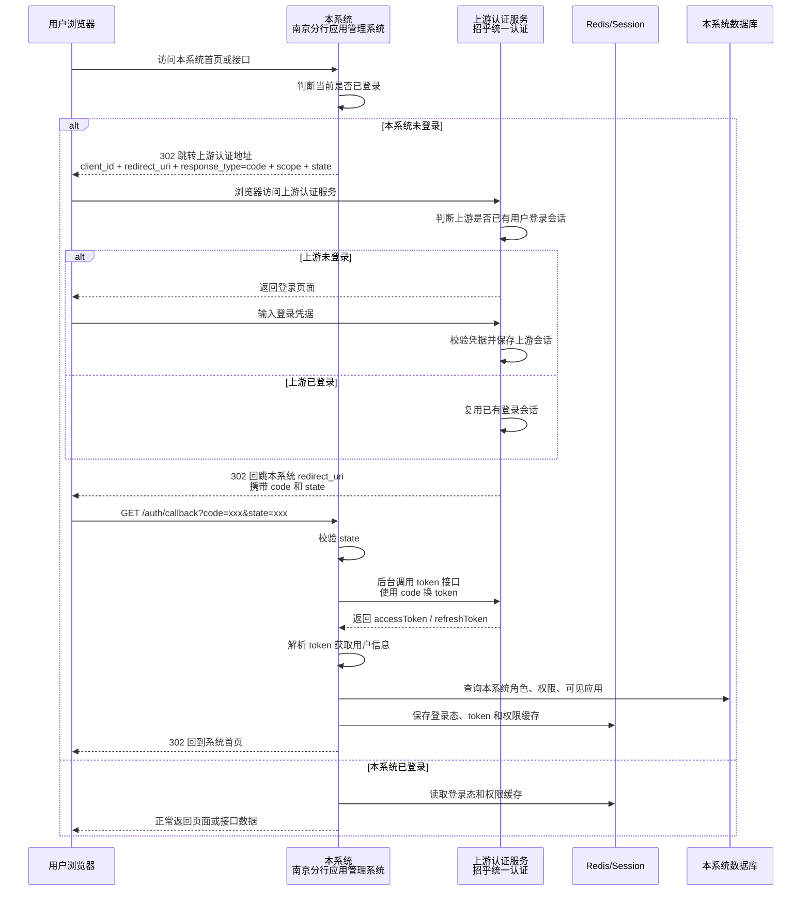
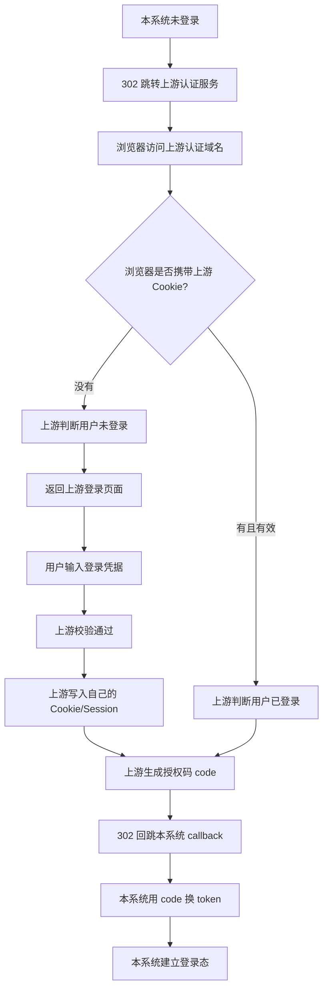
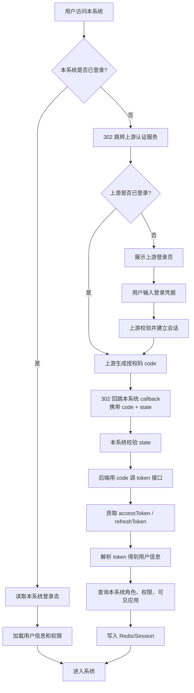
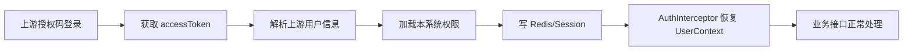
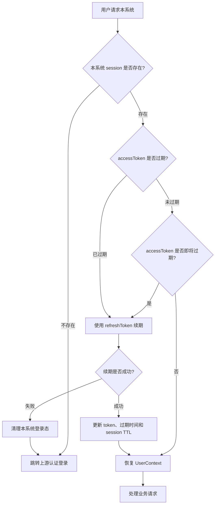
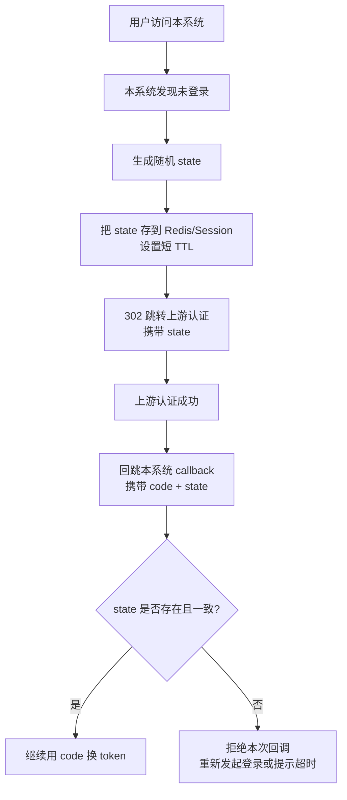

# 上游系统认证对接流程

## 一、背景说明

本系统在上游统一认证平台中注册为一个应用，应用名称为“南京分行应用管理系统”。

用户访问本系统时，如果本系统判断当前用户还没有登录，需要将浏览器重定向到上游认证服务。上游认证成功后，会带着授权码 `code` 回跳到本系统。本系统再通过后台接口使用 `code` 换取 `accessToken` 和 `refreshToken`，解析 token 得到用户身份，并建立本系统自己的登录态。

这条链路解决的是：

```text
上游统一认证平台 -> 本系统
```

它和“本系统 -> 下游业务系统”的认证对接不是一回事。上游认证负责证明“当前访问本系统的人是谁”，本系统仍然需要根据自己的数据库和权限模型判断“这个人在本系统里能看什么、能管什么”。

### 1.0 默认进入页面

上游系统点击“南京分行应用管理系统”后，默认进入本系统门户首页：

```text
默认页面：/
默认初始化接口：GET /api/portal/init
```

默认配置：

```yaml
portal:
  upstream-auth:
    default-redirect: /
```

注意区分两个地址：

| 地址 | 作用 |
| --- | --- |
| `redirect_uri` | 注册给上游认证服务的回调地址，例如 `/api/auth/callback` |
| `default-redirect` | 本系统登录成功后跳回的前端页面，默认 `/` |

也就是说：

```text
上游认证完成
  -> 回调 /api/auth/callback
  -> 本系统换 token 并建立 PORTAL_SESSION
  -> 302 回门户首页 /
  -> 前端调用 GET /api/portal/init
```

### 1.1 当前实现状态（2026-05-14）

| 能力 | 状态 | 对应位置 |
| --- | --- | --- |
| 发起上游登录 | 已实现 | `portal-service` 的 `GET /api/auth/login` |
| 上游 callback | 已实现 | `portal-service` 的 `GET /api/auth/callback` |
| state 生成、校验、一次性删除 | 已实现 | Redis 前缀 `portal:auth:state:` |
| 本系统登录态 | 已实现 | Cookie `PORTAL_SESSION` + Redis 前缀 `portal:session:` |
| 后续请求认证 | 已实现 | `AuthInterceptor` 支持 `Authorization` 和 `PORTAL_SESSION` |
| refreshToken 自动续期 | 已实现 | `PortalSessionRefreshFilter` |
| 退出登录 | 已实现 | `POST /api/auth/logout` |
| 上游统一登出 | 待确认 | 需看上游是否提供登出接口 |

---

## 二、认证登录整体流程



### 2.1 上游是否已登录由谁判断

“上游是否已有用户登录会话”不是本系统判断的，而是上游认证服务自己判断的。

本系统只负责在未登录时把浏览器 302 跳转到上游认证地址。浏览器访问上游认证服务时，会自动携带上游认证服务域名下的 Cookie。上游认证服务根据自己的 Cookie/Session 判断用户是否已经登录。

```text
本系统看不到上游认证服务的 Cookie。
上游认证服务也看不到本系统自己的 Cookie。
浏览器访问哪个域名，就自动携带哪个域名下的 Cookie。
```

示例：

| 系统 | 示例域名 | Cookie 归属 |
| --- | --- | --- |
| 上游认证服务 | `oa-auth.paas.cmbchina.com` | 上游认证 Cookie |
| 本系统 | `portal.example.com` | 本系统 Cookie |

因此，本系统不需要、也通常不能直接判断上游是否已登录。它只能通过跳转后的结果间接感知：

| 跳转结果 | 含义 |
| --- | --- |
| 很快回跳本系统 callback，并携带 `code` | 上游已有有效登录会话，或用户刚刚完成登录 |
| 浏览器展示上游登录页 | 上游没有有效登录会话，或要求用户重新认证 |

### 2.2 没有上游 Cookie 时的流程

如果浏览器没有上游认证服务域名下的 Cookie，上游认证服务会判断用户未登录，并返回登录页面。



常见没有上游 Cookie 的情况：

| 情况 | 说明 |
| --- | --- |
| 第一次访问上游认证体系 | 浏览器从未登录过上游认证服务 |
| 换浏览器或无痕窗口 | 没有历史 Cookie |
| 清理浏览器 Cookie | 上游会话丢失 |
| 上游 Cookie 过期 | 浏览器不再携带有效 Cookie |
| 上游服务主动失效会话 | 即使 Cookie 存在也可能无效 |
| 域名不一致 | Cookie 不能跨无关域名共享 |
| Cookie 安全策略限制 | `SameSite`、`Secure`、HTTP/HTTPS 等策略可能影响携带 |

没有上游 Cookie 不影响本系统发起登录，只是意味着上游不能静默登录，用户需要在上游页面完成一次真实登录。

---

## 三、简化流程图



---

## 四、认证登录地址

上游认证登录接口通过浏览器 GET 方式访问，本系统需要使用 302 将浏览器重定向到对应环境的认证地址。

| 环境 | 地址 |
| --- | --- |
| UAT 环境 | `https://one-account-gateway.paasuat.cmbchina.cn/auth-server/auth` |
| 生产环境（办公网、互联网访问） | `https://oa-auth.paas.cmbchina.com/auth-server/auth` |
| 生产环境（业务网） | `https://oa-auth.paas.cmbchina.cn/auth-server/auth` |

请求参数示例：

```text
https://one-account-gateway.paasuat.cmbchina.cn/auth-server/auth
?client_id=xxx
&redirect_uri=xxx
&response_type=code
&scope=xxx
&state=xxx
```

实际拼接时应放在同一行，并对 `redirect_uri` 做 URL 编码。

---

## 五、登录跳转参数说明

| 参数 | 类型 | 说明 | 是否必填 | 建议 |
| --- | --- | --- | --- | --- |
| `client_id` | string | 上游认证平台分配给本系统的客户端 ID | 必填 | 从配置文件读取，不写死在代码中 |
| `response_type` | string | 授权响应类型 | 必填 | 固定传 `code` |
| `redirect_uri` | string | 登录成功后的本系统回跳地址 | 选填 | 实际建议必传，并做 URL 编码 |
| `scope` | string | 申请授权范围 | 选填 | 按上游分配值填写，未明确时可先使用 `default` |
| `state` | string | 随机值，用于防止 CSRF 和串联登录上下文 | 选填 | 实际建议必传，5 分钟有效，用后删除 |

`redirect_uri` 注意事项：

- 必须进行 URL 编码。
- 回跳地址中不建议携带 `#` 等浏览器片段标识。
- 如果回跳地址自身带查询参数，必须整体编码后再拼到上游认证地址中。

示例：

```text
原始回调地址:
https://portal.example.com/api/auth/callback

编码后:
https%3A%2F%2Fportal.example.com%2Fapi%2Fauth%2Fcallback
```

---

## 六、上游回跳说明

用户在上游认证成功后，上游认证中心会根据 `redirect_uri` 参数回跳到本系统，并携带授权码 `code`。

回跳格式示例：

```http
HTTP/1.1 302 Found
Location: http://test.paas.cmbchina.com/login?code=Spr9w8f9cwe6g9rh62Wer&state=afo0e83ew
```

本系统需要提供回调入口，例如：

```text
GET /api/auth/callback?code=xxx&state=xxx
```

回调入口的职责：

1. 校验 `code` 是否存在。
2. 校验 `state` 是否存在且与本系统发起登录时保存的值一致。
3. 使用 `code` 后台调用上游 token 接口。
4. 获取 `accessToken`、`refreshToken` 和过期时间。
5. 解析 token 或调用用户信息接口，获取当前登录用户。
6. 建立本系统登录态。
7. 重定向回本系统首页。

---

## 七、Token 获取和登录态建立

本系统收到授权码后，需要通过后端调用上游认证服务的 token 接口。该接口对应上游文档中的“Token 获取接口 - 授权码模式”。

典型请求参数如下，具体字段以招乎统一认证文档为准：

```text
grant_type=authorization_code
code=xxx
client_id=xxx
client_secret=xxx
redirect_uri=xxx
```

典型响应内容如下，具体字段名以招乎统一认证文档为准：

```json
{
  "accessToken": "xxx",
  "refreshToken": "xxx",
  "expiresIn": 10800
}
```

拿到 token 后，本系统需要完成三件事：

1. 解析 `accessToken`，获得当前用户的基础信息。
2. 根据用户 ID 查询本系统内的管理员身份、应用权限和可见应用。
3. 保存本系统登录态，供后续请求使用。

推荐登录态保存方式：

```text
浏览器 Cookie:
  PORTAL_SESSION=随机会话ID
  HttpOnly
  Secure
  SameSite=Lax

Redis:
  portal:session:{sessionId} -> {
    "userId": "U001",
    "accessToken": "xxx",
    "refreshToken": "xxx",
    "expiresAt": "2026-05-14T13:00:00"
  }
```

后续接口请求时，本系统通过 Cookie 中的 `PORTAL_SESSION` 找到当前用户，再恢复 `UserContext`。

---

## 八、与当前系统认证链路的关系

当前项目已有内部认证和权限加载链路：

```text
请求携带 token
  -> AuthInterceptor
  -> Redis 查询 token 与用户身份缓存
  -> 缓存未命中时回源认证
  -> 加载用户角色和可见应用
  -> 写入 UserContext
  -> 执行业务接口
```

接入上游授权码登录后，应在这条链路前面补一段“登录获取 token”的流程：



建议职责边界如下：

| 层级 | 职责 |
| --- | --- |
| 上游认证服务 | 证明用户身份，签发 `code`、`accessToken`、`refreshToken` |
| 本系统认证入口 | 发起登录跳转、接收 callback、使用 code 换 token |
| 本系统权限服务 | 根据用户 ID 加载系统管理员、应用管理员、业务管理员和可见应用 |
| 本系统拦截器 | 后续请求中恢复用户上下文，执行权限校验 |

一句话概括：

```text
上游负责认证“这个人是谁”，本系统负责授权“这个人能做什么”。
```

---

## 九、推荐新增接口

### 9.1 发起登录

```text
GET /api/auth/login
```

职责：

1. 生成随机 `state`。
2. 将 `state` 写入 Redis 或 Session，设置短 TTL，例如 5 分钟。
3. 拼接上游认证服务地址。
4. 302 跳转到上游认证服务。

### 9.2 登录回调

```text
GET /api/auth/callback?code=xxx&state=xxx
```

职责：

1. 校验 `state`。
2. 使用 `code` 换取 token。
3. 解析 token 获取用户信息。
4. 加载本系统权限。
5. 建立本系统登录态。
6. 302 跳转回前端首页。

### 9.3 退出登录

```text
POST /api/auth/logout
```

职责：

1. 清理本系统 Cookie。
2. 删除 Redis 中的会话和权限缓存。
3. 如上游提供统一登出接口，可按需跳转或后台调用。

### 9.4 Token 续期

当前实现不向前端暴露独立刷新接口，而是由 `PortalSessionRefreshFilter` 在请求进入时自动判断并续期。

内部职责：

1. 判断 `accessToken` 是否即将过期。
2. 使用 `refreshToken` 调上游刷新 token 接口。
3. 更新 Redis 中保存的 token 信息。

如果后续需要手动刷新能力，可再增加 `POST /api/auth/refresh`，但默认不建议前端直接感知 token 刷新。

---

## 十、Token 有效期与续期

根据上游说明：

- `accessToken` 默认有效期为 3 小时，可在注册应用配置中修改。
- `refreshToken` 默认有效期为 7 天，可在注册应用配置中修改。
- token 续期通过 `refreshToken` 获取新的 token。

### 10.1 本系统登录态与上游 token 的关系

本系统登录态不应独立于上游 token 长期存在。推荐以 `accessToken` 的剩余有效期作为本系统登录态 TTL 的上限：

```text
本系统 session TTL = min(上游 accessToken 剩余有效期, 本系统最大会话有效期)
```

如果上游返回：

```text
accessToken expiresIn = 10800 秒，即 3 小时
```

本系统可以同步设置：

```text
Cookie Max-Age = 10800 秒
Redis session TTL = 10800 秒
Redis 用户权限缓存 TTL <= 10800 秒
```

这样可以避免本系统登录态超过上游 token 生命周期。

### 10.2 为什么仍可能出现过期不同步

即使按上游 `expiresIn` 设置 TTL，也可能出现本系统登录态先失效、上游认证仍有效的情况。

常见场景：

| 场景 | 结果 |
| --- | --- |
| 本系统 Redis 登录态被主动清理 | 本系统失效，上游仍可能有效 |
| 浏览器清理本系统 Cookie | 本系统无法识别用户，上游仍可能有效 |
| 本系统部署重启且 session 未持久化 | 本系统登录态丢失，上游仍可能有效 |
| 用户长时间未操作，本系统采用较短滑动过期 | 本系统先过期 |
| 多浏览器或无痕窗口访问 | 当前浏览器没有本系统登录态 |

这种情况下，本系统需要重新走上游授权流程。但如果上游仍有登录会话，上游通常不会再次要求用户输入凭据，而是直接生成新的授权码 `code` 回跳本系统。

### 10.3 推荐续期策略

建议本系统处理策略如下：

1. Redis 中保存 `accessToken`、`refreshToken` 和过期时间。
2. 初次登录时，本系统 session TTL 使用上游返回的 `expiresIn`。
3. 每次请求恢复登录态时，检查 `accessToken` 是否已经过期或即将过期。
4. 如果 `accessToken` 未过期，正常恢复 `UserContext` 并处理业务请求。
5. 如果 `accessToken` 距离过期不足一定阈值，例如 10 分钟，自动使用 `refreshToken` 调上游刷新 token 接口。
6. 刷新成功后，更新 Redis 中的 `accessToken`、`refreshToken`、过期时间，并同步更新本系统 session TTL。
7. 刷新失败或 `refreshToken` 已过期时，清理本系统登录态，重新跳转上游认证登录。

推荐阈值：

```text
accessToken 剩余有效期 <= 10 分钟时触发刷新
```

### 10.4 请求过程中的判断流程



### 10.5 TTL 设置示例

假设上游 token 接口返回：

```json
{
  "accessToken": "xxx",
  "refreshToken": "yyy",
  "expiresIn": 10800
}
```

本系统可以保存：

```text
portal:session:{sessionId} -> {
  "userId": "U001",
  "accessToken": "xxx",
  "refreshToken": "yyy",
  "accessTokenExpireAt": "2026-05-14T13:00:00",
  "lastRefreshAt": "2026-05-14T10:00:00"
}
TTL: 10800 秒
```

同时浏览器 Cookie：

```http
Set-Cookie: PORTAL_SESSION=随机会话ID; Max-Age=10800; HttpOnly; Secure; SameSite=Lax
```

如果后续 refreshToken 成功续期，重新设置：

```text
Redis session TTL = 新 accessToken expiresIn
Cookie Max-Age = 新 accessToken expiresIn
```

### 10.6 本系统登录态是否可以比上游 token 更长

不建议。

如果本系统 session 有效期长于上游 `accessToken`，会出现本系统认为用户仍在线、但上游 token 已失效的情况。此时如果本系统还继续放行业务请求，会削弱上游统一认证的安全边界。

推荐原则：

```text
本系统登录态有效期 <= 上游 accessToken 有效期
```

如果希望用户长时间无感使用，应通过 `refreshToken` 合法续期，而不是让本系统 session 单独延长。

---

## 十一、安全建议

### 11.1 state 校验

虽然上游文档中 `state` 是选填，但本系统应当强制使用。

`state` 是本系统发起登录时生成的一次性随机值，主要作用有两个：

1. 防止伪造登录回调。
2. 保存登录前上下文，例如用户原本想访问的页面。

基本流程：



推荐结构：

```text
portal:auth:state:{state} -> {
  "redirectAfterLogin": "/",
  "createdAt": "2026-05-14T10:00:00"
}
TTL: 300 ~ 600 秒
```

推荐 TTL：

| 登录方式 | 建议 TTL |
| --- | --- |
| 普通账号密码登录 | 5 分钟 |
| 涉及扫码、短信或较慢确认流程 | 10 分钟 |

不建议设置过长，例如 30 分钟以上。`state` 不是登录态，只是一次登录跳转过程中的临时防伪凭证。

callback 处理规则：

1. 如果 `state` 存在且一致，继续使用 `code` 换 token。
2. 校验成功后立即删除 `state`，避免重复使用。
3. 如果 `state` 不存在、已过期或不一致，拒绝本次 callback。
4. `state` 过期只影响当前这一次登录回调，不影响已经登录成功的用户。

`state` 过期时的处理建议：

```text
state 已过期
  -> 清理当前临时状态
  -> 返回“登录已超时，请重新登录”
  -> 或直接重新跳转 /api/auth/login
```

因此，`state` 后期过期没有影响。正常情况下，登录成功后它本来就应该被删除；如果用户登录太慢导致过期，只需要重新发起一次登录流程。

### 11.2 token 保存

不建议把上游 `accessToken` 和 `refreshToken` 暴露给前端页面或长期保存到 localStorage。

推荐方式：

- token 保存在服务端 Redis。
- 浏览器只保存本系统自己的随机会话 ID。
- Cookie 使用 `HttpOnly`、`Secure`、`SameSite=Lax`。

### 11.3 redirect_uri 白名单

本系统回调地址需要提前在上游认证平台注册。不同环境应使用不同回调地址：

```text
UAT:
https://uat-portal.example.com/api/auth/callback

生产:
https://portal.example.com/api/auth/callback
```

### 11.4 授权码使用

`code` 只能使用一次，且有效期通常很短。本系统 callback 收到 `code` 后应立即换 token，不要缓存授权码。

---

## 十二、待确认事项

真正开发前还需要确认以下信息：

1. 本系统在上游注册的 `client_id`。
2. 本系统在上游注册的 `client_secret`。
3. UAT 和生产环境的 `redirect_uri` 白名单。
4. `scope` 应传固定值、`default`，还是按应用分配值。
5. token 接口地址。
6. 授权码模式 token 接口的请求方式和参数格式。
7. refreshToken 接口的请求方式和参数格式。
8. token 是 JWT 还是普通 opaque token。
9. 如果是 JWT，需要确认签名算法、公钥获取方式和用户字段名。
10. 如果不是 JWT，需要确认是否提供用户信息接口。
11. token 中用户 ID、用户名、机构、部门等字段与本系统字段的映射关系。
12. 是否需要接入上游统一登出。

---

## 十三、落地建议

推荐分两步实施。

第一步，完成最小可用登录闭环：

1. 新增 `/api/auth/login`。
2. 新增 `/api/auth/callback`。
3. 接入授权码换 token。
4. 解析用户信息。
5. 建立本系统登录态。
6. 复用现有权限加载和缓存能力。

第二步，完善生产级能力：

1. refreshToken 自动续期。
2. 统一登出。
3. state 防重放。
4. Cookie 安全属性。
5. 多环境配置隔离。
6. 登录失败、token 失效、用户无权限等异常页面或错误码。
