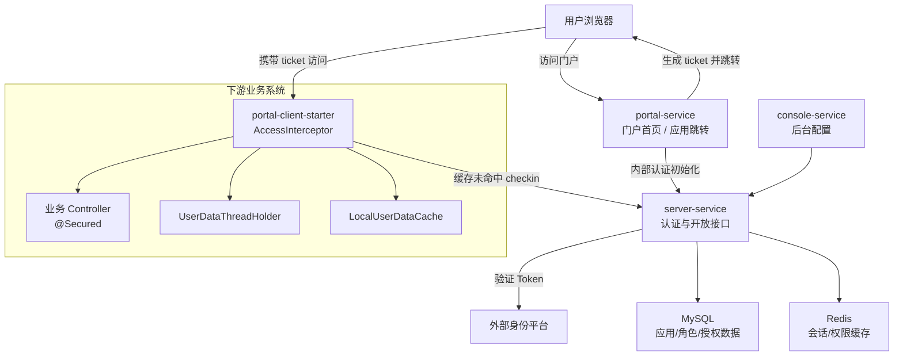
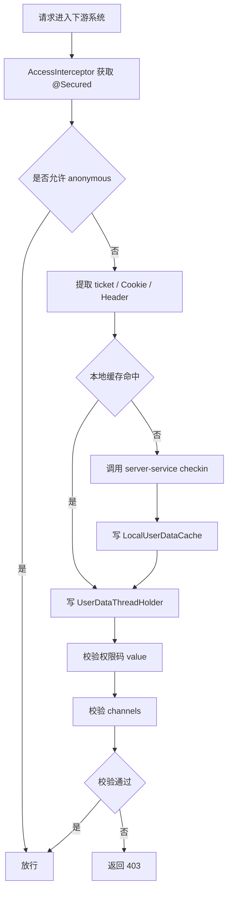

# 下游系统认证对接设计

## 一、背景说明

### 1.1 原 OWK 系统定位

原 OWK 系统是内部应用统一入口。用户先访问 OWK，在 OWK 首页看到自己可访问的内部应用列表；点击某个应用后，浏览器继续跳转到具体下游业务系统。

因此 OWK 不只是一个“应用导航页”，还承担了统一会话和身份分发能力：

- OWK 自身需要识别当前用户，展示可见应用。
- 下游系统需要识别从 OWK 跳转过来的用户。
- 下游系统需要基于 OWK 提供的权限信息执行接口级鉴权。
- 下游业务代码需要以统一方式获取当前登录用户信息。

原 OWK 通过 `owk-web` 框架包把认证能力下沉到下游系统。下游系统只要引入依赖、配置网关地址、使用 `@Secured` 注解，就可以复用 OWK 的认证、缓存、线程上下文和权限校验逻辑。

### 1.2 当前重构项目定位

当前 `portal-v2` 项目用于重构 OWK 系统。已有模块如下：

| 模块 | 职责 |
| --- | --- |
| `portal-service` | 门户首页、应用展示、应用跳转信息 |
| `console-service` | 管理后台，维护应用、分组、管理员、自定义角色和人员 |
| `server-service` | 认证初始化、权限数据加载、对外开放接口 |
| `portal-common` | 公共模型、缓存、拦截器、异常、用户上下文 |

当前项目已经具备“门户自身认证”的基本能力：`portal-service` / `console-service` 通过 `AuthInterceptor` 拦截请求，查 Redis 缓存；缓存未命中时通过 Feign 调用 `server-service` 加载身份和权限。

但如果要完整替代原 OWK，还需要补齐“下游系统认证对接”能力，也就是原 `owk-web + /checkinUserData` 这套机制的新版本。

---

## 二、原 OWK 对接模式

### 2.1 框架依赖关系

```text
┌─────────────────────────────────────────────────────────────────────┐
│                        OWK 框架（本系统）                             │
│  owk-web 模块提供：                                                   │
│  • @Secured 注解定义                                                  │
│  • AccessInterceptor 拦截器                                           │
│  • UserDataThreadHolder 线程上下文                                    │
│  • LocalUserDataCache 用户会话缓存                                    │
│  • LocalUserData 用户数据对象                                         │
└───────────────────────────────┬─────────────────────────────────────┘
                                │
                                │ 依赖 owk-web jar 包
                                ▼
┌─────────────────────────────────────────────────────────────────────┐
│                     下游服务系统                                      │
│  • 引入 owk-web 依赖                                                  │
│  • 配置 OWK 网关地址                                                   │
│  • 在 Controller 上使用 @Secured 注解                                  │
│  • 通过 UserDataThreadHolder.get() 获取用户信息                       │
└─────────────────────────────────────────────────────────────────────┘
```

这个模式的本质是：OWK 不要求每个下游系统自己实现认证拦截器，而是把一套统一客户端框架发布成 jar 包，让下游系统复用。

### 2.2 OWK 自身使用 `@Secured` 的逻辑

OWK 服务自身作为服务端独立部署时，也会使用 `@Secured` 做接口保护。

处理流程：

1. 请求进入 OWK 服务。
2. `AccessInterceptor` 拦截请求。
3. 从 Cookie 或 Header 中提取 `OSESSIONID`。
4. 从 OWK 本地 `LocalUserDataCache` 获取用户数据。
5. 将用户数据写入 `UserDataThreadHolder`。
6. 根据 `@Secured` 配置检查权限码、渠道限制、匿名访问等规则。
7. 校验通过后执行 Controller 方法。
8. 业务代码通过 `UserDataThreadHolder.get()` 获取当前用户。
9. 请求结束后清理 ThreadLocal。

OWK 自身不需要远程调用 `/checkinUserData`，因为用户会话数据已经存在于 OWK 本地缓存。

```text
用户请求 OWK
  -> AccessInterceptor
  -> 获取 OSESSIONID
  -> 查 LocalUserDataCache
  -> 写 UserDataThreadHolder
  -> 校验 @Secured
  -> 执行业务接口
```

### 2.3 下游系统使用 `@Secured` 的逻辑

下游系统引入 `owk-web` 后，认证入口也在本地 `AccessInterceptor`，但下游系统一开始没有 OWK 的用户数据，因此需要远程调用 OWK。

处理流程：

1. 下游系统在 `pom.xml` 中引入 `owk-web` 依赖。
2. 在 `application.yml` 中配置 `owk.client.gateway`。
3. `WebCommonAutoConfiguration` 自动注册 `AccessInterceptor`。
4. 下游 Controller 类或方法上使用 `@Secured` 注解。
5. 用户从 OWK 点击应用跳转到下游系统。
6. 下游系统收到请求，`AccessInterceptor` 拦截。
7. 从 Cookie 或 Header 中获取 `OSESSIONID`。
8. 先查本地 `LocalUserDataCache`。
9. 本地缓存未命中时，调用 OWK 的 `/checkinUserData` 接口。
10. OWK 返回用户身份、权限码、渠道等用户数据。
11. 下游系统写入本地 `LocalUserDataCache`。
12. 下游系统写入 `UserDataThreadHolder`。
13. 校验 `@Secured` 注解中的权限码、渠道限制、匿名访问等规则。
14. 校验通过后执行 Controller。
15. 业务代码通过 `UserDataThreadHolder.get()` 获取用户信息。
16. 请求结束后清理 ThreadLocal。

```text
用户请求下游系统
  -> 下游 AccessInterceptor
  -> 获取 OSESSIONID
  -> 查下游本地 LocalUserDataCache
  -> 未命中则调用 OWK /checkinUserData
  -> 写本地缓存
  -> 写 UserDataThreadHolder
  -> 校验 @Secured
  -> 执行业务接口
```

### 2.4 原模式的核心区别

| 场景 | 用户数据来源 | 是否远程调用 OWK | ThreadLocal 来源 |
| --- | --- | --- | --- |
| OWK 自身接口 | OWK 本地缓存 | 否 | OWK 本地 `LocalUserDataCache` |
| 下游系统接口 | 下游本地缓存；未命中回源 OWK | 是 | 下游本地 `LocalUserDataCache` 或 `/checkinUserData` 响应 |

这也是重构时最关键的边界：门户系统自身认证和下游系统认证对接不是一回事。前者服务于 `portal-service` / `console-service`，后者服务于所有被跳转的业务系统。

---

## 三、当前项目已有能力分析

### 3.1 已有门户自身认证链路

当前项目内部认证链路如下：

```text
浏览器请求 portal-service / console-service
  -> AuthInterceptor 提取 Authorization Token 或通过 PORTAL_SESSION Cookie 恢复 accessToken
  -> 查 Redis: portal:token:{token}
  -> 查 Redis: portal:identity:{userId}
  -> 命中则恢复 UserContext
  -> 未命中则 Feign 调 server-service /internal/auth/init
  -> server-service 调外部身份平台验证 Token
  -> server-service 查询管理员身份和可见应用
  -> 写 Redis
  -> 返回用户身份和权限
  -> portal/console 写 UserContext
```

这个链路解决的是“新 OWK 自身如何识别用户”。

2026-05-14 更新：portal-service 已新增上游授权码登录入口 `/api/auth/login`、回调 `/api/auth/callback` 和本系统会话 Cookie `PORTAL_SESSION`。下游系统认证对接仍是另一条链路，后续短期 ticket / checkin 能力尚未在本次改造中实现。

### 3.2 已有开放接口

当前 `server-service` 已提供面向下游系统的开放接口：

| 接口 | 作用 |
| --- | --- |
| `GET /api/open/apps/{appCode}/users/{userId}/roles` | 查询指定用户在指定应用下的角色 |
| `GET /api/open/apps/{appCode}/users/{userId}/access` | 判断指定用户是否有指定应用访问权限 |

这些接口适合下游系统在“已经知道 userId”的情况下查询角色和权限。

但它们还不能完全替代原 OWK 的 `/checkinUserData`，因为旧流程中下游系统拿到的是 `OSESSIONID`，需要先通过 OWK 换取用户身份，再进行权限判断。

### 3.3 当前缺口

要完整支持下游系统认证对接，建议补齐以下能力：

| 缺口 | 说明 |
| --- | --- |
| 下游 checkin 接口 | 下游系统拿 token 或 ticket 换取用户身份、应用访问权限和角色 |
| 下游客户端 SDK/Starter | 复刻原 `owk-web` 的低成本接入体验 |
| 跳转凭证设计 | 明确门户跳转下游时传递 token、sessionId、ticket 还是 JWT |
| 下游本地缓存模型 | 降低每次请求远程调用认证服务的压力 |
| 兼容旧注解语义 | 尽量保留 `@Secured`、权限码、渠道、匿名访问等概念 |

---

## 四、推荐目标方案

### 4.1 总体推荐

推荐采用“服务端 checkin 接口 + 下游客户端 Starter + 短期跳转 ticket”的方案。

核心思想：

- 新 OWK 门户负责展示应用并生成跳转凭证。
- 下游系统不直接信任浏览器参数。
- 下游系统通过客户端 Starter 拦截请求。
- Starter 使用跳转凭证调用 `server-service` 做 checkin。
- `server-service` 返回统一用户数据、应用权限和角色。
- 下游系统本地缓存用户数据，并用 ThreadLocal 暴露给业务代码。

### 4.2 推荐链路

```text
用户已登录统一身份平台
  -> 访问 portal-service
  -> portal-service 展示可见应用
  -> 用户点击某个应用
  -> portal-service 生成短期 ticket
  -> 浏览器跳转到下游系统 jumpUrl?ticket=xxx
  -> 下游 AccessInterceptor 拦截请求
  -> 从 URL/Cookie/Header 获取 ticket 或会话凭证
  -> 查下游本地 LocalUserDataCache
  -> 未命中则调用 server-service /api/open/auth/checkin
  -> server-service 校验 ticket、应用 clientId/clientSecret、访问权限
  -> 返回用户信息、角色、权限码、应用权限
  -> 下游写本地缓存和 UserDataThreadHolder
  -> 校验 @Secured
  -> 执行业务接口
```

### 4.3 推荐架构图



---

## 五、跳转凭证设计

### 5.1 可选方案对比

| 方案 | 说明 | 优点 | 风险/缺点 |
| --- | --- | --- | --- |
| 继续传 `OSESSIONID` | 沿用旧 OWK 会话标识 | 下游改造最小 | 长期会话凭证跨系统传递，安全边界弱 |
| 传统一身份平台 Token | 下游拿 Token 调新 OWK checkin | 简单直接 | Token 暴露面扩大，URL 传递风险较高 |
| 传短期 ticket | 门户点击应用时生成一次性或短期 ticket | 安全性较好，可限制应用、过期时间、使用次数 | 需要新增 ticket 生成和校验逻辑 |
| 传 JWT | 门户签发包含用户信息的 JWT，下游本地验签 | 减少服务端 checkin 调用 | 密钥轮换、吊销、权限实时性更复杂 |

### 5.2 推荐使用短期 ticket

推荐使用短期 ticket，原因：

- ticket 生命周期短，泄露影响较小。
- ticket 可以绑定 `appCode`，只能用于指定下游应用。
- ticket 可以绑定 `userId`、生成时间、过期时间、跳转来源。
- ticket 可以设计为一次性使用，避免重放。
- 下游最终仍需回调 `server-service`，权限数据保持集中和可控。

### 5.3 ticket 建议结构

ticket 不建议直接把用户信息明文放在 URL 中。推荐生成随机值，并在 Redis 存储上下文：

```text
portal:ticket:{ticket} -> {
  "ticket": "random-uuid-or-secure-token",
  "userId": "U001",
  "appCode": "salary-pay",
  "token": "original-user-token-or-token-ref",
  "issuedAt": "2026-05-12T10:00:00",
  "expireAt": "2026-05-12T10:02:00",
  "used": false
}
```

建议 TTL：`60 ~ 180` 秒。

### 5.4 跳转 URL 示例

```text
https://salary.example.com/owk-entry?ticket=abc123
```

下游系统首次收到 ticket 后，可以由服务端设置自己的 HttpOnly Cookie，例如：

```text
Set-Cookie: PORTAL_SESSION=local-session-id; HttpOnly; Secure; SameSite=Lax
```

后续请求可以使用下游自己的本地会话标识，而不必一直在 URL 中携带 ticket。

---

## 六、服务端接口设计建议

### 6.1 生成跳转 ticket

该接口供 `portal-service` 在用户点击应用时调用，或直接由 `portal-service` 内部实现。

```text
POST /internal/tickets
Header:
  X-Internal-Token: {internal-token}
Body:
  {
    "userId": "U001",
    "appCode": "salary-pay"
  }
```

响应：

```json
{
  "code": 200,
  "message": "success",
  "data": {
    "ticket": "abc123",
    "expireSeconds": 120
  }
}
```

生成逻辑：

1. 校验内部调用权限。
2. 校验当前用户是否有目标应用访问权限。
3. 生成安全随机 ticket。
4. 写入 Redis，TTL 建议 2 分钟。
5. 返回 ticket。

### 6.2 下游 checkin 接口

该接口是原 `/checkinUserData` 的新版本。

```text
POST /api/open/auth/checkin
Header:
  X-Client-Id: {clientId}
  X-Client-Secret: {clientSecret}
Body:
  {
    "appCode": "salary-pay",
    "ticket": "abc123"
  }
```

响应：

```json
{
  "code": 200,
  "message": "success",
  "data": {
    "user": {
      "userId": "U001",
      "userName": "张三",
      "orgId": "NJ001",
      "orgName": "南京分行",
      "deptId": "D001",
      "deptName": "信息技术部"
    },
    "appCode": "salary-pay",
    "hasAccess": true,
    "roles": [
      {
        "roleCode": "salary-pay_operator",
        "roleName": "经办岗"
      }
    ],
    "permissions": [
      "salary:query",
      "salary:submit"
    ],
    "channels": [
      "PC"
    ],
    "expireSeconds": 1800
  }
}
```

校验逻辑：

1. 校验 `X-Client-Id` 和 `X-Client-Secret`。
2. 校验 `clientId` 是否属于请求中的 `appCode`。
3. 校验 ticket 是否存在、未过期、未使用、绑定的 `appCode` 是否一致。
4. 查询或加载用户身份。
5. 校验用户是否有该应用访问权限。
6. 查询用户在该应用下的角色和权限码。
7. 标记 ticket 已使用，或删除 ticket。
8. 返回下游系统需要的用户数据。

### 6.3 兼容 token checkin 的备选接口

如果短期内无法改造跳转流程，也可以先提供兼容模式：

```text
POST /api/open/auth/checkin
Header:
  X-Client-Id: {clientId}
  X-Client-Secret: {clientSecret}
Body:
  {
    "appCode": "salary-pay",
    "token": "original-token"
  }
```

兼容模式适合迁移过渡，但生产长期推荐 ticket 模式。

---

## 七、下游客户端 Starter 设计建议

### 7.1 模块建议

建议新增一个面向下游系统的客户端模块：

```text
portal-client-starter
```

如果要降低旧系统迁移成本，也可以采用兼容命名：

```text
owk-web-compatible
```

### 7.2 Starter 提供的能力

| 能力 | 说明 |
| --- | --- |
| `@Secured` | 声明接口权限码、渠道、匿名访问 |
| `AccessInterceptor` | 拦截下游请求，执行 token/ticket 提取、checkin、缓存、鉴权 |
| `UserDataThreadHolder` | 用 ThreadLocal 暴露当前用户信息 |
| `LocalUserDataCache` | 下游本地缓存用户数据，减少远程 checkin |
| `LocalUserData` | 统一用户数据模型 |
| `PortalClientProperties` | 读取网关地址、clientId、clientSecret、缓存 TTL 等配置 |
| `PortalAuthClient` | 调用 `server-service` checkin / roles / access 接口 |
| 自动配置类 | Spring Boot 自动注册拦截器和客户端 Bean |

### 7.3 下游配置示例

```yaml
portal:
  client:
    gateway: https://portal.example.com
    app-code: salary-pay
    client-id: client_salary
    client-secret: ${PORTAL_CLIENT_SECRET}
    cache-ttl-seconds: 1800
    token-name: OSESSIONID
    ticket-param-name: ticket
```

### 7.4 下游使用示例

```java
@RestController
@RequestMapping("/salary")
public class SalaryController {

    @Secured(value = "salary:query", channels = {"PC"})
    @GetMapping("/records")
    public Result<?> records() {
        LocalUserData user = UserDataThreadHolder.get();
        return Result.success(querySalary(user.getUserId()));
    }
}
```

### 7.5 拦截器处理流程



---

## 八、权限模型映射

### 8.1 原 OWK `@Secured` 语义

原 `@Secured` 通常包含以下维度：

| 字段 | 含义 |
| --- | --- |
| `value` | 权限码或权限标识 |
| `channels` | 允许访问渠道 |
| `anonymous` | 是否允许匿名访问 |

### 8.2 新系统映射建议

| 原概念 | 新系统建议 |
| --- | --- |
| 权限码 `value` | 由应用自定义角色或权限码表维护，checkin 时返回 |
| 渠道 `channels` | 作为应用访问策略或用户会话属性返回 |
| 匿名访问 `anonymous` | Starter 本地判断，不需要远程 checkin |
| `LocalUserData` | 映射为新 `PortalUserData`，可保留旧类名做兼容 |
| `UserDataThreadHolder` | 保留同名兼容类，内部使用新模型 |

### 8.3 角色与权限码关系

当前项目已有自定义角色和用户角色关系。如果下游 `@Secured(value = "xxx")` 校验的是权限码，而不是角色码，则建议新增或明确一层模型：

```text
app_custom_role
  -> role_permission
  -> permission_code
```

如果短期内不做权限码表，也可以先约定：

- `@Secured.value` 直接对应 `roleCode`。
- 下游系统根据角色码自行做更细粒度权限判断。

长期更推荐角色和权限码分离，否则角色变更会影响接口权限表达。

---

## 九、迁移方案

### 9.1 第一阶段：兼容旧接入方式

目标：尽量少改下游系统。

建议：

- 新增 `owk-web-compatible` 客户端包。
- 保留 `@Secured` 注解名称和核心字段。
- 保留 `UserDataThreadHolder.get()` 使用方式。
- 支持从 Cookie/Header 读取 `OSESSIONID`。
- 提供 token checkin 接口，兼容旧链路。

适合场景：

- 下游系统数量多。
- 短期无法统一改造跳转入口。
- 希望先完成 OWK 服务端替换。

### 9.2 第二阶段：引入 ticket 跳转

目标：收紧安全边界。

建议：

- 门户点击应用时生成短期 ticket。
- 下游入口页或拦截器消费 ticket。
- ticket 校验成功后下游建立本地会话。
- URL 中的 ticket 使用后立即失效。

适合场景：

- 逐步改造重点系统。
- 降低长期 token 跨系统传播风险。

### 9.3 第三阶段：统一 Starter 和权限模型

目标：形成标准化接入规范。

建议：

- 统一下游配置格式。
- 统一用户数据对象。
- 统一错误码。
- 明确 `@Secured.value` 是权限码还是角色码。
- 完善权限码管理和角色权限绑定。

---

## 十、安全建议

### 10.1 ticket 安全

- ticket 必须使用安全随机数生成。
- ticket TTL 建议 `60 ~ 180` 秒。
- ticket 应绑定 `userId`、`appCode`、生成时间。
- ticket 推荐一次性使用。
- ticket 使用后立即删除或标记已使用。
- 不要在 ticket 中明文承载用户信息。

### 10.2 下游调用安全

- 下游调用 checkin 必须携带 `clientId` 和 `clientSecret`。
- `clientSecret` 只允许后端保存，不允许出现在前端。
- `clientSecret` 应支持后台重置。
- checkin 接口应限制调用频率。
- checkin 接口应记录调用日志，便于审计。

### 10.3 会话缓存安全

- 下游本地缓存 TTL 不应长于门户身份缓存 TTL。
- 用户权限变更后，应支持主动失效相关用户缓存。
- 下游本地 Cookie 应使用 `HttpOnly`、`Secure`、`SameSite`。
- ThreadLocal 必须在请求结束后清理，避免线程复用导致身份串号。

---

## 十一、推荐落地清单

### 11.1 服务端改造

1. 新增 ticket 生成接口或内部服务方法。
2. 新增 `POST /api/open/auth/checkin`。
3. 扩展 checkin 响应，返回用户基础信息、应用访问权限、角色和权限码。
4. 完善 `clientId/clientSecret` 校验。
5. 增加 ticket Redis 缓存和一次性消费逻辑。
6. 增加 checkin 调用日志。

### 11.2 客户端 Starter

1. 新建 `portal-client-starter` 或 `owk-web-compatible` 模块。
2. 实现 `@Secured` 注解。
3. 实现 `AccessInterceptor`。
4. 实现 `UserDataThreadHolder`。
5. 实现 `LocalUserDataCache`。
6. 实现 `PortalAuthClient`。
7. 提供 Spring Boot 自动装配。
8. 输出下游接入文档和示例工程。

### 11.3 兼容和迁移

1. 梳理现有下游系统对 `owk-web` 的使用方式。
2. 确认 `@Secured.value` 当前实际含义。
3. 确认旧 `LocalUserData` 字段清单。
4. 确认旧 `/checkinUserData` 响应结构。
5. 设计新旧字段映射表。
6. 选择 1 个下游系统作为试点接入。

---

## 十二、结论

原 OWK 的下游认证对接并不是简单 HTTP 查询，而是一套“客户端框架 + 远程 checkin + 本地缓存 + ThreadLocal + 注解鉴权”的组合能力。

当前 `portal-v2` 已经具备门户自身认证、权限加载和部分开放接口能力，但要完整替代原 OWK，还需要新增面向下游系统的认证对接层。

推荐目标方案是：

```text
portal-service 负责门户展示和跳转 ticket 生成
server-service 负责 checkin、ticket 校验、权限查询
portal-client-starter 负责下游系统本地拦截、缓存、ThreadLocal 和 @Secured 鉴权
```

这样既能延续原 OWK 的低成本接入体验，又能通过短期 ticket 收紧安全边界，适合作为本次 OWK 重构的下游认证对接方向。
