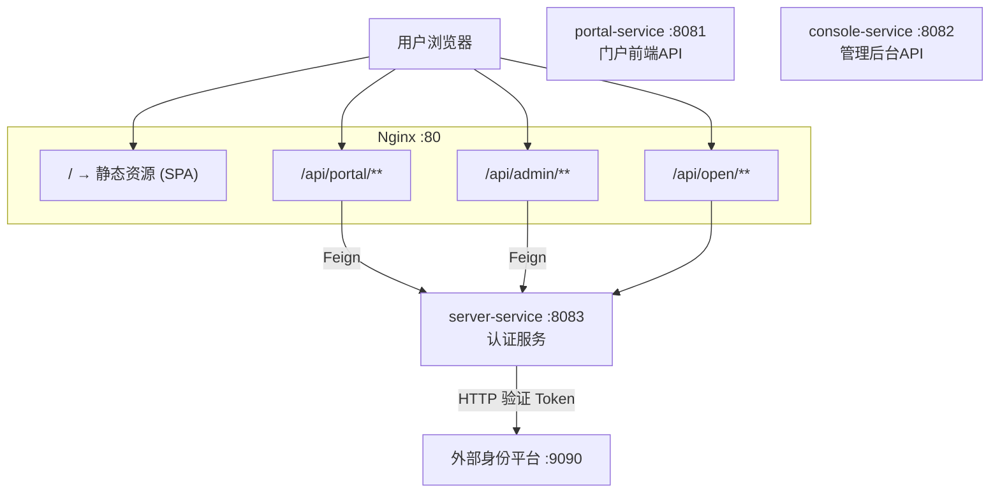
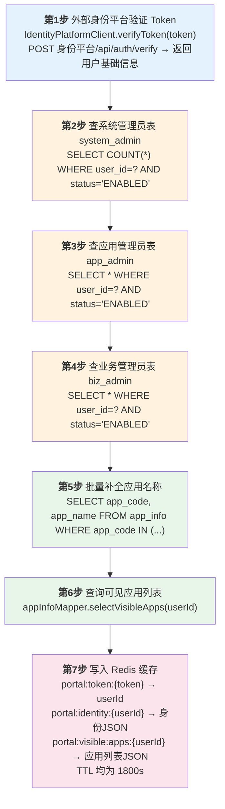
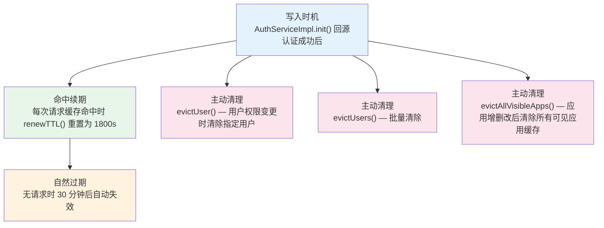
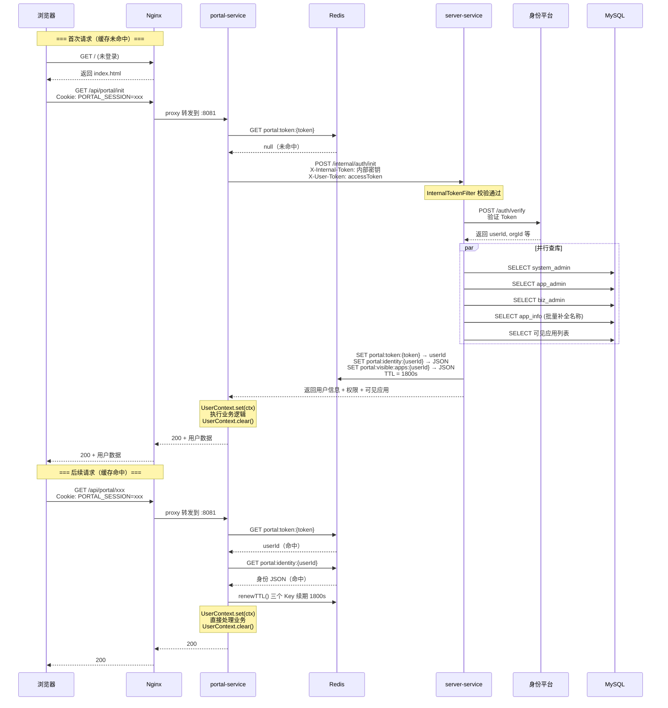

# Portal-V2 认证流程全链路分析

## 一、系统架构总览



### 涉及的核心文件

| 层级 | 文件 | 职责 |
|------|------|------|
| Nginx | `nginx/portal.conf` | 反向代理、SPA 路由、静态资源缓存 |
| 拦截器 | `portal-common/.../security/AuthInterceptor.java` | Token 提取、两级缓存查询、UserContext 填充与清理 |
| 内部过滤器 | `portal-common/.../security/InternalTokenFilter.java` | 保护 `/internal/**` 路径，校验内部调用 Token |
| 缓存管理 | `portal-common/.../cache/PermissionCacheManager.java` | Redis 三级缓存读写、TTL 续期、批量清理 |
| 缓存常量 | `portal-common/.../cache/CacheConstants.java` | 缓存 Key 前缀和默认 TTL |
| 用户上下文 | `portal-common/.../context/UserContext.java` | ThreadLocal 存储当前用户身份，提供权限判断方法 |
| 权限校验 | `portal-common/.../security/PermissionChecker.java` | 静态工具类，封装角色鉴权逻辑 |
| 认证服务 | `server-service/.../service/impl/AuthServiceImpl.java` | 核心认证：调外部平台、查库、写缓存 |
| 认证控制器 | `server-service/.../controller/AuthController.java` | 暴露 `/internal/auth/init` 供 Feign 调用 |
| 身份平台客户端 | `server-service/.../client/IdentityPlatformClient.java` | HTTP 调用外部身份平台验证 Token |
| Feign 客户端 | `portal-service/.../feign/ServerFeignClient.java` | 声明式 Feign 接口，调用 server-service |
| 拦截器注册 | `portal-service/.../config/WebMvcConfig.java` | 将 AuthInterceptor 注册到 `/api/portal/**` |
| 拦截器注册 | `console-service/.../config/WebMvcConfig.java` | 将 AuthInterceptor 注册到 `/api/admin/**` |
| 过滤器注册 | `server-service/.../config/WebMvcConfig.java` | 将 InternalTokenFilter 注册到 `/internal/*` |

---

## 二、完整请求链路（从用户访问到业务响应）

### 第 1 步：用户从外部统一门户跳转

用户已在外部身份平台登录，外部平台生成 Token，通过 URL 参数跳转：

```
https://portal.example.com/?token=xxxx
```

Nginx 匹配 `location /`，返回 `index.html`，前端 SPA 接管路由。

**对应配置：** `nginx/portal.conf:13-17`

```nginx
location / {
    root   /usr/share/nginx/html;
    index  index.html;
    try_files $uri $uri/ /index.html;   # SPA 标准写法
}
```

### 第 2 步：前端触发上游登录

前端调用 `/api/portal/init` 如果收到 401，则跳转：

```
GET /api/auth/login?redirect=当前页面
```

`portal-service` 生成 `state`，302 跳转上游认证服务。上游认证成功后回跳：

```
GET /api/auth/callback?code=xxx&state=xxx
```

后端使用 `code` 换取 `accessToken` / `refreshToken`，建立本系统 `PORTAL_SESSION` Cookie。

### 第 3 步：前端调用初始化接口

```
GET /api/portal/init
Cookie: PORTAL_SESSION=xxxx
```

Nginx 匹配 `location /api/portal/`，转发到 `portal-service:8081`。

**对应配置：** `nginx/portal.conf:20-28`

```nginx
location /api/portal/ {
    proxy_pass http://portal;
    proxy_set_header Host $host;
    proxy_set_header X-Real-IP $remote_addr;
    proxy_set_header X-Forwarded-For $proxy_add_x_forwarded_for;
    proxy_set_header X-Forwarded-Proto $scheme;
}
```

### 第 4 步：AuthInterceptor 拦截 — Token 提取

请求进入 Spring MVC 后，被 `AuthInterceptor.preHandle()` 拦截。

**拦截器注册：** `portal-service/.../config/WebMvcConfig.java:34-66`

```java
// 拦截路径
new MappedInterceptor(new String[]{"/api/portal/**"}, null, interceptor);
```

**Token 提取逻辑：** `AuthInterceptor`

```java
private String extractToken(HttpServletRequest request) {
    String header = request.getHeader("Authorization");
    if (header != null && header.startsWith("Bearer ")) {
        return header.substring(7);
    }
    if (header != null && !header.isEmpty()) {
        return header;
    }
    return extractTokenFromSession(request); // 从 PORTAL_SESSION Cookie 恢复 accessToken
}
```

- 无 Token → 抛出 `UnauthorizedException("未提供认证Token")` → 返回 401

### 第 5 步：AuthInterceptor — 两级缓存查询

#### 第一级：Token → userId 映射

```java
// AuthInterceptor.java:44
String userId = cacheManager.getUserIdByToken(token);
// 底层: Redis GET portal:token:{token}
```

- **命中** → 拿到 userId，继续查第二级
- **未命中** → 直接走第 6 步回源认证

#### 第二级：userId → 身份信息 JSON

```java
// AuthInterceptor.java:55
String identityJson = cacheManager.getIdentity(userId);
// 底层: Redis GET portal:identity:{userId}
```

- **命中** → 从 JSON 反序列化为 `UserContext`，完成认证
- **未命中** → 走第 6 步回源认证

#### 两级都命中时 — TTL 续期

```java
// AuthInterceptor.java:66
cacheManager.renewTTL(token, userId);
// 重置三个 key 的 TTL 为 1800 秒（30分钟）
```

```java
// PermissionCacheManager.java:114-121
public void renewTTL(String token, String userId) {
    redisTemplate.expire(CacheConstants.TOKEN_PREFIX + token,       1800, SECONDS);
    redisTemplate.expire(CacheConstants.IDENTITY_PREFIX + userId,   1800, SECONDS);
    redisTemplate.expire(CacheConstants.VISIBLE_APPS_PREFIX + userId, 1800, SECONDS);
}
```

### 第 6 步：缓存未命中 — Feign 回源认证

缓存不存在时，`AuthInterceptor` 调用注入的 `AuthFallbackHandler`（Lambda），通过 Feign 远程调用 server-service：

```java
// portal-service/WebMvcConfig.java:41
Result<AuthInitResponse> result = serverFeignClient.initAuth(internalToken, token);
```

Feign 请求：

```
POST http://server-service:8083/internal/auth/init
Header: X-Internal-Token = {内部服务调用密钥}
Header: X-User-Token = {用户accessToken}
```

**Feign 接口定义：** `portal-service/.../feign/ServerFeignClient.java`

```java
@FeignClient(name = "server-service")
public interface ServerFeignClient {
    @PostMapping("/internal/auth/init")
    Result<AuthInitResponse> initAuth(@RequestHeader("X-Internal-Token") String internalToken,
                                      @RequestHeader("X-User-Token") String token);
}
```

### 第 7 步：InternalTokenFilter — 内部接口保护

请求到达 server-service 前，先经过 `InternalTokenFilter`（Servlet Filter，优先级最高）：

```java
// InternalTokenFilter.java:33-37
if (path.startsWith("/internal")) {
    String token = request.getHeader("X-Internal-Token");
    if (token == null || !token.equals(internalToken)) {
        throw new ForbiddenException("内部接口认证失败");
    }
}
```

**配置值：** `portal.internal-token=${INTERNAL_TOKEN:portal-internal-secret-2026}`

> **当前实现：** 内部调用密钥和用户 token 已拆分。`X-Internal-Token` 只用于内部接口鉴权，`X-User-Token` 才是用户 accessToken。

### 第 8 步：AuthServiceImpl — 核心认证逻辑（7 步）

通过 Filter 后进入 `AuthController.init()`，从 `X-User-Token` 读取用户 accessToken，再调用 `AuthServiceImpl.init(token)`：



**对应源码：** `server-service/.../service/impl/AuthServiceImpl.java:52-129`

### 第 9 步：响应返回 — 填充 UserContext

Feign 调用成功后，`AuthInterceptor` 的 `AuthFallbackHandler` Lambda 将 `AuthInitResponse` 转为 `AuthInitResult`，然后填充 `UserContext`：

```java
// AuthInterceptor.java:88-101
private void fillContext(AuthInitResult result) {
    UserContext ctx = new UserContext();
    ctx.setUserId(result.getUserId());
    ctx.setUserName(result.getUserName());
    ctx.setOrgId(result.getOrgId());
    ctx.setOrgName(result.getOrgName());
    ctx.setDeptId(result.getDeptId());
    ctx.setDeptName(result.getDeptName());
    ctx.setSystemAdmin(result.isSystemAdmin());
    ctx.setAppAdminApps(result.getAppAdminApps());
    ctx.setBizAdminApps(result.getBizAdminApps());
    ctx.setAdmin(ctx.isAdmin());
    UserContext.set(ctx);   // 存入 ThreadLocal
}
```

后续业务 Controller 可以直接通过 `UserContext.get()` 获取当前用户信息，无需传参。

### 第 10 步：业务方法 — 权限校验

业务 Controller 中通过 `PermissionChecker` 做鉴权：

```java
// 系统管理员权限
PermissionChecker.requireSystemAdmin();

// 应用管理员权限
PermissionChecker.requireAppAdmin("APP001");

// 业务管理员权限
PermissionChecker.requireBizAdmin("APP001");

// 按权限过滤应用列表
List<String> scoped = PermissionChecker.filterAppCodesByScope(allAppCodes);
```

底层从 `UserContext`（ThreadLocal）读取角色信息进行判断，校验失败抛出 `ForbiddenException` → 返回 403。

### 第 11 步：请求结束 — 清理上下文

```java
// AuthInterceptor.java:71-73
public void afterCompletion(...) {
    UserContext.clear();   // 清理 ThreadLocal，防止内存泄漏/身份串号
}
```

---

## 三、Redis 缓存结构

### 缓存 Key 命名空间

| Key 模式 | Value | TTL | 用途 |
|----------|-------|-----|------|
| `portal:token:{token}` | userId | 1800s | Token → 用户快速定位 |
| `portal:identity:{userId}` | 身份信息 JSON | 1800s | 避免重复查库 |
| `portal:visible:apps:{userId}` | 可见应用列表 JSON | 1800s | 门户首页展示 |

### 缓存生命周期



### identity JSON 结构示例

```json
{
  "userId": "U001",
  "userName": "张三",
  "orgId": "ORG001",
  "orgName": "技术部",
  "deptId": "DEPT001",
  "deptName": "研发一组",
  "isAdmin": true,
  "isSystemAdmin": false,
  "appAdminApps": [
    { "appCode": "APP001", "appName": "用户中心" }
  ],
  "bizAdminApps": [
    { "appCode": "APP002", "appName": "审批系统" }
  ]
}
```

---

## 四、完整时序图



---

## 五、三级权限模型

### 角色定义

| 角色 | 数据来源表 | 权限范围 |
|------|-----------|---------|
| 系统管理员 | `system_admin` | 所有应用的所有操作，自动拥有应用管理员和业务管理员权限 |
| 应用管理员 | `app_admin` | 指定应用的基础配置、管理员、角色管理 |
| 业务管理员 | `biz_admin` | 指定应用的业务角色和人员 |

### 权限判断逻辑

```java
// UserContext.java

// 系统管理员拥有所有应用的管理权限（短路返回）
public boolean isAppAdmin(String appCode) {
    if (isSystemAdmin) return true;
    return appAdminApps.stream().anyMatch(a -> a.getAppCode().equals(appCode));
}

public boolean isBizAdmin(String appCode) {
    if (isSystemAdmin) return true;
    return bizAdminApps.stream().anyMatch(a -> a.getAppCode().equals(appCode));
}

// 任一管理员身份即为 admin
public boolean isAdmin() {
    return isSystemAdmin
        || (appAdminApps != null && !appAdminApps.isEmpty())
        || (bizAdminApps != null && !bizAdminApps.isEmpty());
}
```

### 应用可见性规则

```sql
-- appInfoMapper.selectVisibleApps(userId) 的逻辑
SELECT * FROM app_info a
WHERE a.status = 'ENABLED'
  AND (
    a.visible_type = 'ALL'                     -- 全部可见
    OR EXISTS (SELECT 1 FROM user_role ...)     -- 有角色关联
    OR EXISTS (SELECT 1 FROM app_admin ...)     -- 是应用管理员
    OR EXISTS (SELECT 1 FROM biz_admin ...)     -- 是业务管理员
  )
```

---

## 六、异常处理

| 异常 | HTTP 状态码 | 触发场景 |
|------|------------|---------|
| `UnauthorizedException` | 401 | 未提供 Token、Token 验证失败 |
| `ForbiddenException` | 403 | 内部接口认证失败、权限不足 |

所有异常由 `GlobalExceptionHandler` 统一捕获，返回标准格式：

```json
{
  "code": 401,
  "message": "未提供认证Token",
  "data": null
}
```

前端收到 401 时跳转 `/api/auth/login?redirect=当前页面`，由后端发起上游授权码登录。

---

## 七、值得关注的点

### 1. Feign 内部密钥与用户 Token 已拆分

当前实现中，`X-Internal-Token` 只传内部服务调用密钥，`X-User-Token` 传用户 accessToken。`InternalTokenFilter` 只校验内部密钥，业务认证由 `AuthController` 把 `X-User-Token` 交给 `AuthServiceImpl` 处理。

### 2. Token 注入风险

`IdentityPlatformClient` 用字符串拼接构建 JSON：

```java
String body = "{\"token\":\"" + token + "\"}";
```

如果 Token 含引号等特殊字符可能导致 JSON 注入，建议改为 `JSONUtil.toJsonStr()` 序列化。

### 3. 无主动 Token 失效机制

Token 注销后只能等 Redis 缓存自然过期（30 分钟），没有主动失效入口。如果需要即时失效，需要新增接口清除对应的缓存 Key。

### 4. 未使用成熟安全框架

没有 Spring Security / Shiro，认证完全自研。好处是轻量灵活，但需要自行保证安全性（如 CSRF 防护、XSS 防护、请求频率限制等）。

### 5. 内部 Token 默认值

`portal.internal-token` 的默认值为 `portal-internal-secret-2026`，生产环境务必通过环境变量 `INTERNAL_TOKEN` 覆盖为强随机值。
