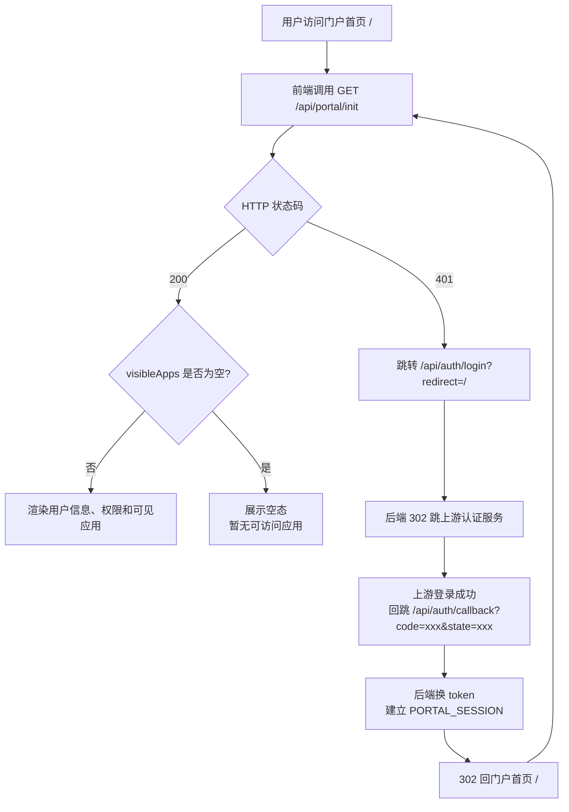
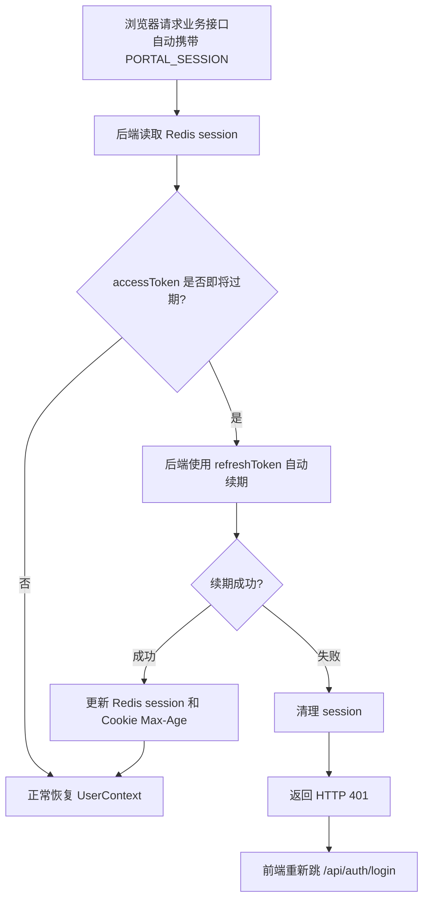

# 前端对接文档

> 本文档面向前端开发，说明页面结构、接口调用、路由跳转和权限控制。
> 前端可以用这份文档配合 AI 工具完成开发。

---

## 一、系统概述

**统一应用门户** — 南京分行应用管理系统。核心功能：
- 门户首页：展示用户可见的应用，点击跳转
- 后台管理：管理员配置应用、角色、人员

**用户不会在本系统输入账号密码。** 用户访问本系统后，由后端跳转到上游统一认证平台完成授权码登录；登录成功后，本系统通过 `PORTAL_SESSION` Cookie 维护自己的登录态。

---

## 二、服务地址

| 服务 | 端口 | 前端需要调用 | 说明 |
|------|------|-------------|------|
| portal-service | 8081 | 是 | 门户首页相关接口，`/api/portal/**` |
| console-service | 8082 | 是 | 后台管理接口，`/api/admin/**` |
| server-service | 8083 | 否 | 内部认证服务，前端不直接调用 |

> 生产环境通过 Nginx 反向代理统一入口。前端开发阶段可配置两个代理：
> - `/api/portal/*` → `http://localhost:8081`
> - `/api/admin/*` → `http://localhost:8082`

---

## 三、认证机制

### 3.1 当前认证方式（2026-05-14 更新）

当前已接入上游授权码登录模式。本系统作为“南京分行应用管理系统”注册在上游统一认证平台中，前端不再从 URL 中解析上游 Token，也不保存 `accessToken` / `refreshToken`。

上游点击“南京分行应用管理系统”后，默认进入本系统门户首页：

```text
默认前端页面：/
默认初始化接口：GET /api/portal/init
```

前端首页 `/` 的首个动作就是调用 `GET /api/portal/init`。如果返回 401，再跳转 `/api/auth/login?redirect=/` 发起上游登录。

登录完成后，后端会设置本系统自己的 HttpOnly Cookie：

```http
Set-Cookie: PORTAL_SESSION=随机会话ID; Path=/; Max-Age=...; HttpOnly; SameSite=Lax
```

后续请求由浏览器自动携带 Cookie，前端不需要手动拼接认证请求头。

兼容说明：后端 `AuthInterceptor` 仍兼容 `Authorization: Bearer {token}`，但上游 SSO 正式链路推荐使用 `PORTAL_SESSION` Cookie。

### 3.2 前端登录处理流程



```text
1. 页面加载后调用 GET /api/portal/init
2. 如果返回 200，正常渲染；如果 visibleApps 为空，展示“暂无可访问应用”
3. 如果返回 401，跳转到 /api/auth/login?redirect=当前页面路径；默认首页就是 /api/auth/login?redirect=/
4. 后端 302 跳转上游认证服务
5. 上游登录成功后回跳 /api/auth/callback?code=xxx&state=xxx
6. 后端换 token、建立 PORTAL_SESSION，并 302 回 redirect 页面
7. 前端重新调用 GET /api/portal/init
```

### 3.3 前端需要调用的认证接口

| 接口 | 调用方式 | 前端职责 |
| --- | --- | --- |
| `GET /api/portal/init` | AJAX | 首页初始化；返回 401 时触发登录 |
| `GET /api/auth/login?redirect=xxx` | 浏览器跳转 | 发起登录，不用 AJAX 调用 |
| `POST /api/auth/logout` | AJAX | 退出本系统登录态 |

### 3.4 前端不要做的事

- 不要保存上游 `accessToken` / `refreshToken` 到 `localStorage` 或 `sessionStorage`。
- 不要持有或传递 `client_secret`。
- 不要直接调用上游 token 接口。
- 不要把 `403` 当作 `401` 反复跳登录；`403` 主要用于后台越权、内部接口或开放接口鉴权失败。
- 门户首页没有可见应用时不会返回 403，而是 `visibleApps` 为空，前端展示空态。

### 3.5 Token 生命周期



- 上游 `accessToken` 默认有效期 3 小时，`refreshToken` 默认有效期 7 天，实际以注册应用配置为准。
- 后端保存上游 token，并用 `PORTAL_SESSION` 关联 Redis 会话。
- 后端会在 accessToken 即将过期时使用 refreshToken 自动续期。
- 续期失败或 session 失效时，接口返回 `401`，前端重新跳 `/api/auth/login`。

---

## 四、页面结构与路由设计

### 4.1 页面总览

```
/                        → 门户首页（所有用户）
/admin                   → 后台管理入口（仅管理员）
/admin/apps              → 应用管理列表
/admin/apps/:appCode     → 单个应用管理（含多个 Tab）
/admin/app-groups        → 应用分组管理（仅系统管理员）
/admin/system-admins     → 系统管理员管理（仅系统管理员）
/admin/role-users        → 角色人员配置（业务管理员入口）
```

### 4.2 门户首页 `/`

**所有人可见。** 按分组展示用户可访问的应用卡片。

**页面元素：**
- 顶部栏：用户名、所属机构/部门、后台管理入口（仅管理员可见）
- 搜索框：按应用名称搜索
- 应用分组区域：每个分组一个卡片组，内含应用卡片
- 应用卡片：图标 + 名称 + 描述，点击跳转

**页面加载流程：**
```
1. 调用 GET /api/portal/init
2. 从返回数据中提取：
   - user → 显示用户信息
   - isAdmin → 决定是否显示"后台管理"按钮
   - visibleApps → 按分组渲染应用卡片
3. 如果 visibleApps 为空，展示"暂无可访问应用"
4. 用户点击应用卡片 → 调用 GET /api/portal/apps/{appCode}/jump-info
5. 如果 jump-info 返回 data=null，展示"应用不存在或暂无访问入口"，不要跳登录
6. 拿到 jumpUrl 后跳转（iframe 或新窗口，取决于 showMenu/showHeader 配置）
```

**应用跳转规则：**

| 条件 | 跳转方式 |
|------|---------|
| showMenu=true, showHeader=true | iframe 嵌入，展示目标系统菜单和头部 |
| showMenu=false | iframe 嵌入，隐藏目标系统菜单 |
| showHeader=false | iframe 嵌入，隐藏目标系统头部 |
| enableWatermark=true | 在 iframe 上层添加水印 |

> 具体是 iframe 嵌入还是新窗口打开，可以和产品确认。建议统一用新窗口打开（`window.open`），简单可控。

### 4.3 后台管理 `/admin`

**仅管理员可见。** 根据用户身份展示不同的菜单。

**进入后台的条件：** `isAdmin === true`（即 isSystemAdmin 或 appAdminApps 非空或 bizAdminApps 非空）

**左侧菜单结构（根据角色动态展示）：**

| 菜单 | 系统管理员 | 应用管理员 | 业务管理员 |
|------|-----------|-----------|-----------|
| 应用管理 | 显示 | 显示 | 隐藏 |
| 应用分组 | 显示 | 隐藏 | 隐藏 |
| 系统管理员配置 | 显示 | 隐藏 | 隐藏 |
| 角色人员配置 | 隐藏 | 隐藏 | 显示 |

### 4.4 应用管理列表 `/admin/apps`

**权限：** 系统管理员、应用管理员

**页面元素：**
- 搜索条件：应用编号（模糊）、应用名称（模糊）、状态下拉（全部/启用/停用）
- 应用列表表格
- 操作按钮

**列表字段：**

| 字段 | 说明 |
|------|------|
| 应用编号 | appCode |
| 应用名称 | appName |
| 更新人 | updateName |
| 上线状态 | status（ENABLED/DISABLED） |
| 更新时间 | updateTime |
| 创建人 | createName |
| 创建时间 | createTime |
| 操作 | "管理"按钮 → 进入单个应用管理页 |

**数据获取：** `GET /api/admin/apps`

### 4.5 单个应用管理 `/admin/apps/:appCode`

**权限：** 系统管理员、应用管理员（限负责应用）

根据用户身份展示不同 Tab：

| Tab | 系统管理员 | 应用管理员 | 说明 |
|-----|-----------|-----------|------|
| 基础配置 | 可编辑 | 可编辑 | 应用名称、图标、跳转地址等 |
| 应用管理员 | 可增删改 | 可增删改 | 给应用配管理员 |
| 业务管理员 | 可增删改 | 可增删改 | 给应用配业务管理员 |
| 自定义角色 | 可增删改 | 可增删改 | 给应用创建角色 |
| 角色人员 | 可增删改 | 隐藏 | 给角色配人员 |

**页面加载流程：**
```
1. 从列表页点"管理"进来，URL 带 appCode
2. 调用 GET /api/admin/apps/{appCode} 获取应用详情
3. 根据 Tab 调用对应接口加载数据
```

### 4.6 应用分组管理 `/admin/app-groups`

**仅系统管理员可见。**

**页面元素：**
- 分组列表（不需要分页）
- 新增分组、编辑分组、启用/停用分组
- 给分组绑定/移除应用、调整应用排序

> **注意：** 当前分组列表接口只返回分组信息，不返回每个分组下的应用列表。前端如需展示分组内应用，需要额外处理（后续补充或在分组详情中单独查询）。

**数据获取：** `GET /api/admin/app-groups`

### 4.7 系统管理员管理 `/admin/system-admins`

**仅系统管理员可见。**

**页面元素：**
- 搜索条件：用户姓名（模糊）、用户ID/工号
- 分页列表
- 添加、启用/停用、移除

**数据获取：** `GET /api/admin/system-admins`

### 4.8 角色人员配置 `/admin/role-users`

**仅业务管理员可见**（系统管理员在单个应用管理页内也能操作角色人员）。

**页面加载流程：**
```
1. 调用 GET /api/admin/biz-manage/custom-roles 获取可管理的应用和角色
2. 用户选择应用 → 角色下拉联动
3. 选择角色后调用 GET /api/admin/apps/{appCode}/custom-roles/users 查询人员列表
4. 支持添加/移除/启用停用人员
```

---

## 五、完整接口清单

### 5.1 通用响应格式

所有接口统一返回：

```json
{
  "code": 200,
  "message": "success",
  "data": {}
}
```

- `code: 200` — 成功
- `code: 401` — 未认证（Token 无效或过期）
- `code: 403` — 后台越权、内部接口或开放接口鉴权失败；门户无应用不返回 403

分页响应统一结构：
```json
{
  "code": 200,
  "data": {
    "total": 100,
    "list": []
  }
}
```

### 5.2 门户首页接口（portal-service，端口 8081）

#### 5.2.1 首页初始化（核心接口）

**这是首页唯一需要调的接口，一次性返回所有首页数据。**

```
GET /api/portal/init
Cookie: PORTAL_SESSION=...
```

**响应：**

```json
{
  "code": 200,
  "data": {
    "user": {
      "userId": "U001",
      "userName": "张三",
      "orgName": "南京分行",
      "deptName": "信息技术部"
    },
    "isAdmin": true,
    "isSystemAdmin": false,
    "appAdminApps": [
      { "appCode": "salary-pay", "appName": "工资代发系统" }
    ],
    "bizAdminApps": [],
    "visibleApps": [
      {
        "groupCode": "common",
        "groupName": "常用应用",
        "groupSortNo": 1,
        "apps": [
          {
            "appCode": "notice",
            "appName": "通知公告",
            "appIcon": "/icons/notice.png",
            "appDesc": "全行通知公告发布",
            "jumpUrl": "https://notice.example.com",
            "visibleType": "ALL",
            "showMenu": true,
            "showHeader": true,
            "enableWatermark": false,
            "appSortNo": 1
          }
        ]
      }
    ]
  }
}
```

**前端使用说明：**

| 字段 | 用途 |
|------|------|
| `user` | 顶部栏显示用户信息 |
| `isAdmin` | 为 true 时显示"后台管理"入口按钮 |
| `isSystemAdmin` | 控制后台中"应用分组"和"系统管理员"菜单是否显示 |
| `appAdminApps` | 应用管理员身份标识，进入后台后只展示这些应用 |
| `bizAdminApps` | 业务管理员身份标识，控制"角色人员配置"菜单显示 |
| `visibleApps` | 按分组渲染应用卡片，按 groupSortNo 排分组，按 appSortNo 排应用 |

#### 5.2.2 应用跳转

```
GET /api/portal/apps/{appCode}/jump-info
Cookie: PORTAL_SESSION=...
```

**响应：**

```json
{
  "code": 200,
  "data": {
    "appCode": "salary-pay",
    "appName": "工资代发系统",
    "appIcon": "/icons/salary.png",
    "appDesc": "工资代发业务办理",
    "jumpUrl": "https://salary.example.com",
    "visibleType": "ROLE",
    "showMenu": true,
    "showHeader": false,
    "enableWatermark": true
  }
}
```

> 用户在目标系统的角色由下游系统自行通过开放接口 `GET /api/open/apps/{appCode}/users/{userId}/roles` 查询，jump-info 不返回角色信息。

**前端处理：** 拿到 `jumpUrl` 后跳转。`showMenu`/`showHeader`/`enableWatermark` 控制跳转后的展示方式（如果用 iframe 嵌入的话）。

### 5.3 后台管理接口（console-service，端口 8082）

所有后台接口都需要已登录态。当前推荐由浏览器自动携带 `PORTAL_SESSION` Cookie；后端仍兼容 `Authorization: Bearer {token}`。

---

#### 5.3.1 应用管理

##### 应用列表（分页）

```
GET /api/admin/apps?appCode=&appName=&status=&pageNum=1&pageSize=10
```

| 参数 | 必填 | 说明 |
|------|------|------|
| appCode | 否 | 模糊查询 |
| appName | 否 | 模糊查询 |
| status | 否 | ENABLED / DISABLED |
| pageNum | 是 | 页码，从 1 开始 |
| pageSize | 是 | 每页条数 |

**权限范围自动过滤：** 系统管理员看全部，应用管理员看负责应用，业务管理员看管理应用。

##### 应用详情

```
GET /api/admin/apps/{appCode}
```

返回应用完整信息，包括 clientId、jumpUrl、visibleType 等所有配置字段。

##### 新增/修改应用

```
POST /api/admin/apps/save
Content-Type: application/json
```

```json
{
  "appCode": "salary-pay",
  "appName": "工资代发系统",
  "appIcon": "/icons/salary.png",
  "appDesc": "工资代发业务办理",
  "jumpUrl": "https://salary.example.com",
  "orgId": "NJ001",
  "orgName": "南京分行",
  "visibleType": "ROLE",
  "showMenu": true,
  "showHeader": false,
  "enableWatermark": true,
  "enablePromotion": false,
  "sortNo": 1
}
```

| 字段 | 必填 | 说明 |
|------|------|------|
| appCode | 修改必填 | 不传或为空=新增（appCode 后端自动生成），有值=修改 |
| appName | 是 | 应用名称 |
| jumpUrl | 是 | 跳转地址 |
| visibleType | 是 | ALL 全员可见 / ROLE 按角色可见 |
| showMenu | 否 | 是否展示菜单栏，默认 true |
| showHeader | 否 | 是否展示头部，默认 true |
| enableWatermark | 否 | 是否启用水印，默认 false |
| enablePromotion | 否 | 是否启用推广，默认 false |
| sortNo | 否 | 排序号，越小越靠前 |

**新增需要系统管理员权限，修改需要应用管理员权限。**

##### 启用/停用应用

```
PUT /api/admin/apps/{appCode}/status
Content-Type: application/json
```

```json
{ "status": "ENABLED" }
```

##### 重置 ClientSecret（仅系统管理员）

```
POST /api/admin/apps/{appCode}/client-secret/reset
```

**响应：**
```json
{ "code": 200, "data": { "clientSecret": "新生成的密钥（仅展示一次）" } }
```

---

#### 5.3.2 应用管理员配置

```
查询:   GET  /api/admin/apps/{appCode}/app-admins?pageNum=1&pageSize=10
添加:   POST /api/admin/apps/{appCode}/app-admins        body: {"userIds":["U001","U002"]}
启停:   PUT  /api/admin/apps/{appCode}/app-admins/status?status=ENABLED  body: {"userIds":["U001"]}
移除:   DELETE /api/admin/apps/{appCode}/app-admins      body: {"userIds":["U001"]}
```

---

#### 5.3.3 业务管理员配置

```
查询:   GET  /api/admin/apps/{appCode}/biz-admins?pageNum=1&pageSize=10
添加:   POST /api/admin/apps/{appCode}/biz-admins        body: {"userIds":["U003"]}
启停:   PUT  /api/admin/apps/{appCode}/biz-admins/status?status=ENABLED  body: {"userIds":["U003"]}
移除:   DELETE /api/admin/apps/{appCode}/biz-admins      body: {"userIds":["U003"]}
```

---

#### 5.3.4 自定义角色配置

```
查询:   GET  /api/admin/apps/{appCode}/custom-roles?roleCode=&roleName=&status=
新增:   POST /api/admin/apps/{appCode}/custom-roles      body: {"roleCode":"op","roleName":"经办岗","roleDesc":"..."}
修改:   PUT  /api/admin/apps/{appCode}/custom-roles      body: {"roleCode":"op","roleName":"经办岗（修改后）","roleDesc":"..."}
启停:   PUT  /api/admin/apps/{appCode}/custom-roles/status  body: {"roleCode":"op","status":"ENABLED"}
```

**角色查询不分页**，返回列表。查询参数都是可选的。

---

#### 5.3.5 角色人员配置

```
查询:   GET  /api/admin/apps/{appCode}/custom-roles/users?roleCode=xxx&userName=&userId=&status=&pageNum=1&pageSize=10
添加:   POST /api/admin/apps/{appCode}/custom-roles/users      body: {"roleCode":"op","userIds":["U001","U002"]}
启停:   PUT  /api/admin/apps/{appCode}/custom-roles/users/status  body: {"roleCode":"op","userIds":["U001"],"status":"ENABLED"}  （注意：当前只处理单个用户，userIds 传一个）
移除:   DELETE /api/admin/apps/{appCode}/custom-roles/users     body: {"roleCode":"op","userIds":["U001","U002"]}
```

**查询是分页的**，roleCode 是必填参数。

---

#### 5.3.6 业务管理员可管理角色查询

**业务管理员进入后台后调用，获取可管理的应用和角色列表。**

```
GET /api/admin/biz-manage/custom-roles
```

**响应：**

```json
{
  "code": 200,
  "data": [
    {
      "appCode": "salary-pay",
      "appName": "工资代发系统",
      "roles": [
        { "roleCode": "salary-pay_operator", "roleName": "经办岗", "status": "ENABLED" },
        { "roleCode": "salary-pay_checker", "roleName": "审核岗", "status": "ENABLED" }
      ]
    }
  ]
}
```

---

#### 5.3.7 应用分组管理（仅系统管理员）

```
查询:     GET    /api/admin/app-groups
新增:     POST   /api/admin/app-groups            body: {"groupName":"常用应用","orgId":"NJ001","orgName":"南京分行","sortNo":1}
修改:     PUT    /api/admin/app-groups/{groupCode}  body: {"groupName":"新名称","sortNo":2}
启停:     PUT    /api/admin/app-groups/{groupCode}/status  body: {"status":"ENABLED"}
绑定应用: POST   /api/admin/app-groups/{groupCode}/apps    body: {"appCodes":["salary-pay","notice"]}
移除应用: DELETE /api/admin/app-groups/{groupCode}/apps?appCode=salary-pay
应用排序: PUT    /api/admin/app-groups/{groupCode}/apps/sort  body: {"sortItems":[{"appCode":"a","sortNo":1},{"appCode":"b","sortNo":2}]}
```

**分组查询不分页**，返回全部分组列表，每个分组内含绑定的应用。

---

#### 5.3.8 系统管理员管理（仅系统管理员）

```
查询:   GET  /api/admin/system-admins?userName=&userId=&pageNum=1&pageSize=10
添加:   POST /api/admin/system-admins              body: {"userIds":["U001"]}
启停:   PUT  /api/admin/system-admins/{userId}/status  body: {"status":"ENABLED"}
移除:   DELETE /api/admin/system-admins/{userId}
```

---

#### 5.3.9 人员搜索（添加管理员/角色人员时用）

```
GET /api/admin/users/search?keyword=张三&pageNum=1&pageSize=10
```

**响应：**

```json
{
  "code": 200,
  "data": {
    "total": 5,
    "list": [
      {
        "userId": "U001",
        "userName": "张三",
        "orgName": "南京分行",
        "deptName": "信息技术部"
      }
    ]
  }
}
```

> 所有管理员可用。keyword 支持姓名和工号搜索。搜索的是外部身份平台的人员数据。

---

## 六、权限控制前端实现指南

### 6.1 角色判断

调用 `GET /api/portal/init` 后，根据返回数据判断角色：

```javascript
const { isAdmin, isSystemAdmin, appAdminApps, bizAdminApps } = initData;

// 是否显示"后台管理"入口
const showAdminEntry = isAdmin;

// 是否显示"应用分组"和"系统管理员"菜单
const showSystemMenu = isSystemAdmin;

// 是否显示"应用管理"菜单（系统管理员 或 应用管理员）
const showAppManage = isSystemAdmin || (appAdminApps && appAdminApps.length > 0);

// 是否显示"角色人员配置"菜单（系统管理员 或 业务管理员）
const showRoleUserManage = isSystemAdmin || (bizAdminApps && bizAdminApps.length > 0);
```

### 6.2 后台管理菜单生成规则

```javascript
function getAdminMenus(initData) {
  const menus = [];

  if (initData.isSystemAdmin || initData.appAdminApps?.length > 0) {
    menus.push({ name: '应用管理', path: '/admin/apps' });
  }

  if (initData.isSystemAdmin) {
    menus.push({ name: '应用分组', path: '/admin/app-groups' });
    menus.push({ name: '系统管理员配置', path: '/admin/system-admins' });
  }

  if (initData.bizAdminApps?.length > 0) {
    menus.push({ name: '角色人员配置', path: '/admin/role-users' });
  }

  return menus;
}
```

### 6.3 单个应用管理页 Tab 可见性

```javascript
function getAppTabs(userContext, appCode) {
  const tabs = [];

  // 基础配置 — 应用管理员和系统管理员可见
  if (userContext.isSystemAdmin || userContext.appAdminApps?.some(a => a.appCode === appCode)) {
    tabs.push('基础配置');
    tabs.push('应用管理员');
    tabs.push('业务管理员');
    tabs.push('自定义角色');
  }

  // 角色人员 — 系统管理员始终可见
  if (userContext.isSystemAdmin) {
    tabs.push('角色人员');
  }

  return tabs;
}
```

### 6.4 路由守卫建议

```
1. 所有 /admin/* 路由：检查 isAdmin，false 则重定向到首页
2. /admin/app-groups 和 /admin/system-admins：检查 isSystemAdmin
3. /admin/apps/:appCode：检查是否是该应用的管理员（appAdminApps 中包含 appCode 或 isSystemAdmin）
4. /admin/role-users：检查 bizAdminApps 非空或 isSystemAdmin
```

---

## 七、用户访问完整流程图

### 7.1 普通用户

```
外部门户（已登录）
    │
    │ 点击"南京分行应用管理系统"
    ▼
前端首页 /?token=xxx
    │
    │ 1. 存 token 到本地
    │ 2. GET /api/portal/init
    ▼
首页渲染
    │
    │ isAdmin=false → 不显示"后台管理"按钮
    │
    │ 点击应用卡片
    ▼
GET /api/portal/apps/{appCode}/jump-info
    │
    │ 拿到 jumpUrl
    ▼
跳转到目标系统（新窗口 / iframe）
```

### 7.2 系统管理员

```
首页（isAdmin=true，显示"后台管理"按钮）
    │
    │ 点击"后台管理"
    ▼
后台管理页面 /admin
    │
    │ 左侧菜单：应用管理、应用分组、系统管理员配置
    │
    │ 进入"应用管理" → 应用列表（全部应用）
    │   → 点击某个应用 → 进入管理页
    │     → Tab: 基础配置、应用管理员、业务管理员、自定义角色、角色人员
    │
    │ 进入"应用分组" → 分组管理
    │   → 新增/编辑分组、绑定/移除应用、排序
    │
    │ 进入"系统管理员配置" → 管理员列表
    │   → 添加/移除/启停
```

### 7.3 应用管理员

```
首页（isAdmin=true，显示"后台管理"按钮）
    │
    │ 点击"后台管理"
    ▼
后台管理页面 /admin
    │
    │ 左侧菜单：应用管理（仅这一个菜单）
    │
    │ 应用列表（只展示自己负责的应用）
    │   → 点击某个应用 → 进入管理页
    │     → Tab: 基础配置、应用管理员、业务管理员、自定义角色
    │     → 注意：没有"角色人员"Tab
```

### 7.4 业务管理员

```
首页（isAdmin=true，显示"后台管理"按钮）
    │
    │ 点击"后台管理"
    ▼
后台管理页面 /admin
    │
    │ 左侧菜单：角色人员配置（仅这一个菜单）
    │
    │ GET /api/admin/biz-manage/custom-roles → 获取可管理的应用和角色
    │
    │ 选择应用 → 选择角色 → 查看人员列表
    │   → 添加/移除/启停人员
```

---

## 八、枚举值速查

### 状态 status

| 值 | 含义 |
|----|------|
| `ENABLED` | 启用 |
| `DISABLED` | 停用 |

### 可见类型 visibleType

| 值 | 含义 |
|----|------|
| `ALL` | 全员可见 |
| `ROLE` | 按角色可见（只有拥有该应用角色的用户才能看到） |

### 管理范围 manageScope（业务管理员）

| 值 | 含义 |
|----|------|
| `APP` | 应用级管理（可管理该应用下所有角色的人员） |

### 布尔字段说明

| 字段 | 类型 | 含义 |
|------|------|------|
| showMenu | Boolean | true=展示目标系统菜单栏 |
| showHeader | Boolean | true=展示目标系统头部 |
| enableWatermark | Boolean | true=启用水印 |
| enablePromotion | Boolean | true=允许用户自行添加应用 |

---

## 九、前端开发建议

### 9.1 技术选型

无限制，Vue/React/Angular 均可。推荐 Vue 3 + Element Plus 或 React + Ant Design。

### 9.2 关键交互要点

1. **人员选择器**：添加管理员、角色人员时，需要搜索人员。调用 `GET /api/admin/users/search?keyword=xxx`，结果分页展示，支持勾选多个。

2. **应用列表数据范围**：同一个接口 `GET /api/admin/apps`，后端自动根据用户身份过滤。系统管理员看全部，应用管理员只看自己负责的。前端不需要额外处理。

3. **分组内应用排序**：应用分组管理中可以拖拽排序，排好序后调用 `PUT /api/admin/app-groups/{groupCode}/apps/sort` 保存。

4. **操作确认**：删除、移除人员、停用等操作建议二次确认。

5. **ClientSecret**：只展示一次，重置后弹窗展示，用户关闭后无法再查看。

### 9.3 错误处理

```
401 → 跳转 /api/auth/login?redirect=当前页面
403 → 提示"无权限"，停留在当前页或返回上一页，不要重新登录
门户 visibleApps 为空或 jump-info data=null → 展示空态
其他 → 显示后端返回的 message
```

---

## 十、接口快速参考表

### 门户首页

| 方法 | 路径 | 说明 |
|------|------|------|
| GET | `/api/portal/init` | 首页初始化（用户信息+权限+可见应用） |
| GET | `/api/portal/apps/{appCode}/jump-info` | 获取应用跳转信息 |

### 应用管理

| 方法 | 路径 | 说明 | 权限 |
|------|------|------|------|
| GET | `/api/admin/apps` | 应用列表（分页） | D级 |
| GET | `/api/admin/apps/{appCode}` | 应用详情 | B级 |
| POST | `/api/admin/apps/save` | 新增/修改应用 | A/B级 |
| PUT | `/api/admin/apps/{appCode}/status` | 启停应用 | B级 |
| POST | `/api/admin/apps/{appCode}/client-secret/reset` | 重置密钥 | A级 |

### 应用管理员

| 方法 | 路径 | 说明 |
|------|------|------|
| GET | `/api/admin/apps/{appCode}/app-admins` | 查询（分页） |
| POST | `/api/admin/apps/{appCode}/app-admins` | 添加 |
| PUT | `/api/admin/apps/{appCode}/app-admins/status?status=` | 启停 |
| DELETE | `/api/admin/apps/{appCode}/app-admins` | 移除 |

### 业务管理员

| 方法 | 路径 | 说明 |
|------|------|------|
| GET | `/api/admin/apps/{appCode}/biz-admins` | 查询（分页） |
| POST | `/api/admin/apps/{appCode}/biz-admins` | 添加 |
| PUT | `/api/admin/apps/{appCode}/biz-admins/status?status=` | 启停 |
| DELETE | `/api/admin/apps/{appCode}/biz-admins` | 移除 |

### 自定义角色

| 方法 | 路径 | 说明 |
|------|------|------|
| GET | `/api/admin/apps/{appCode}/custom-roles` | 查询（列表） |
| POST | `/api/admin/apps/{appCode}/custom-roles` | 新增 |
| PUT | `/api/admin/apps/{appCode}/custom-roles` | 修改 |
| PUT | `/api/admin/apps/{appCode}/custom-roles/status` | 启停 |

### 角色人员

| 方法 | 路径 | 说明 |
|------|------|------|
| GET | `/api/admin/apps/{appCode}/custom-roles/users` | 查询（分页） |
| POST | `/api/admin/apps/{appCode}/custom-roles/users` | 添加 |
| PUT | `/api/admin/apps/{appCode}/custom-roles/users/status` | 启停 |
| DELETE | `/api/admin/apps/{appCode}/custom-roles/users` | 移除 |
| GET | `/api/admin/biz-manage/custom-roles` | 业务管理员可管理角色 |

### 应用分组

| 方法 | 路径 | 说明 |
|------|------|------|
| GET | `/api/admin/app-groups` | 查询（列表） |
| POST | `/api/admin/app-groups` | 新增 |
| PUT | `/api/admin/app-groups/{groupCode}` | 修改 |
| PUT | `/api/admin/app-groups/{groupCode}/status` | 启停 |
| POST | `/api/admin/app-groups/{groupCode}/apps` | 绑定应用 |
| DELETE | `/api/admin/app-groups/{groupCode}/apps?appCode=` | 移除应用 |
| PUT | `/api/admin/app-groups/{groupCode}/apps/sort` | 应用排序 |

### 系统管理员

| 方法 | 路径 | 说明 |
|------|------|------|
| GET | `/api/admin/system-admins` | 查询（分页） |
| POST | `/api/admin/system-admins` | 添加 |
| PUT | `/api/admin/system-admins/{userId}/status` | 启停 |
| DELETE | `/api/admin/system-admins/{userId}` | 移除 |

### 人员搜索

| 方法 | 路径 | 说明 |
|------|------|------|
| GET | `/api/admin/users/search?keyword=&pageNum=1&pageSize=10` | 搜索人员 |
