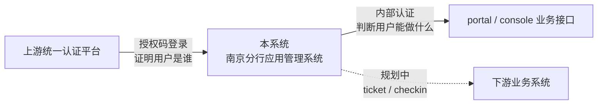
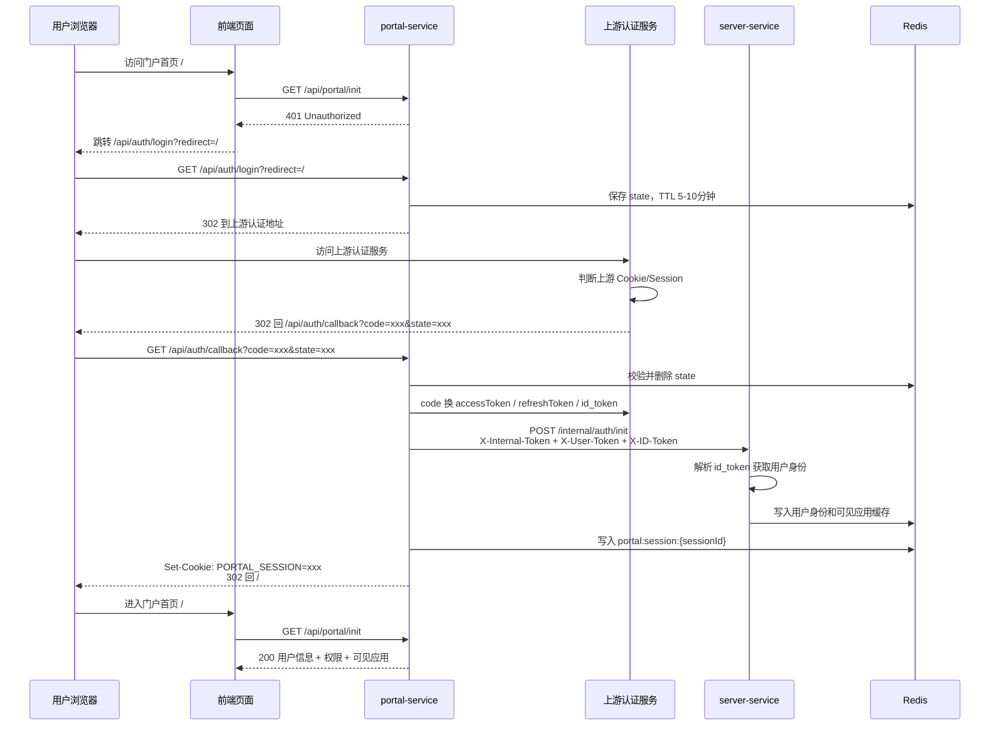
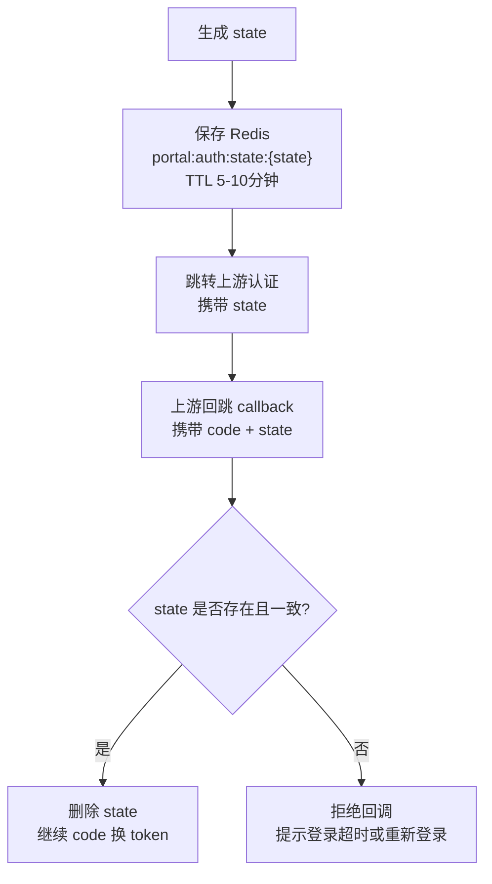
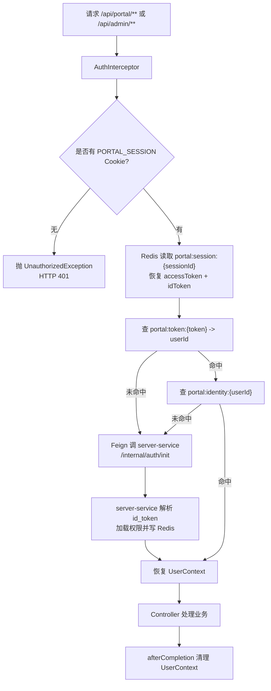
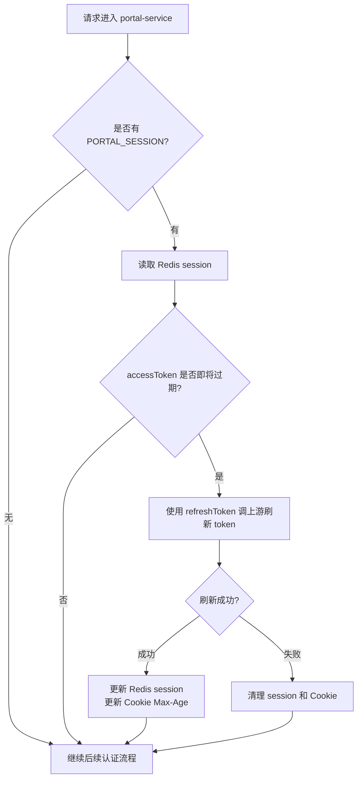
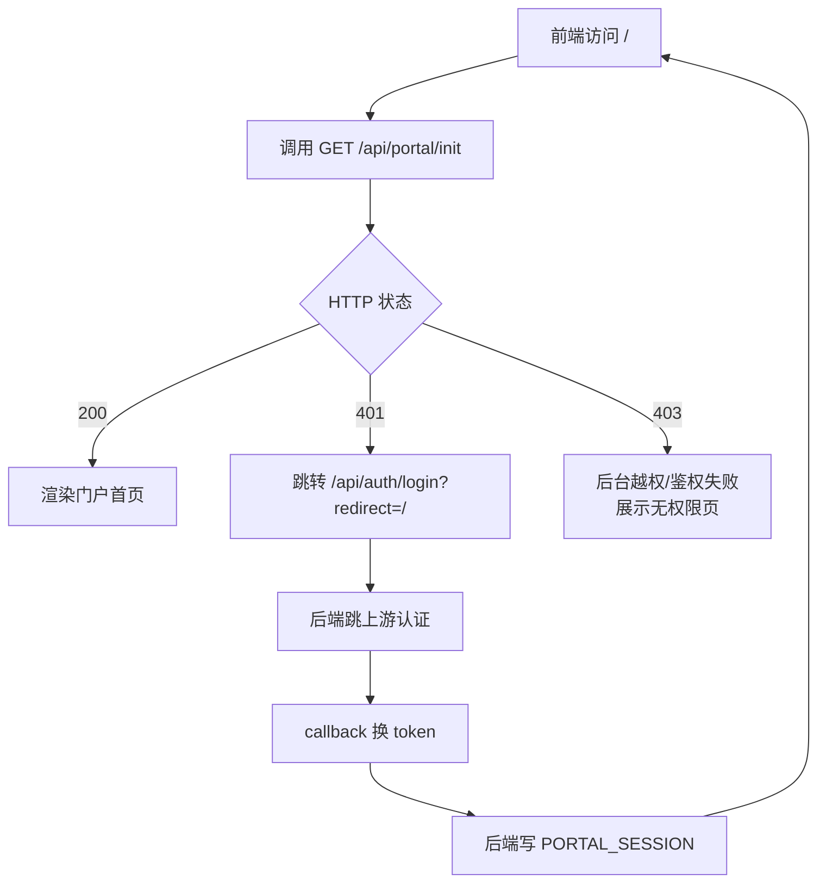

# 认证设计

## 一、认证边界

本系统涉及三条认证链路，必须分清方向和职责：



| 链路 | 当前状态 | 说明 |
| --- | --- | --- |
| 上游 -> 本系统 | 已实现 | 授权码模式，`/api/auth/login`、`/api/auth/callback`、`access_token` / `refresh_token` / `id_token`、`PORTAL_SESSION` |
| 本系统内部认证 | 已实现 | `AuthInterceptor`、Redis、`UserContext`、`PermissionChecker` |
| 本系统 -> 下游系统 | 规划中 | 后续可做短期 ticket、checkin、客户端 starter |

一句话概括：

```text
上游负责认证“这个人是谁”，本系统负责授权“这个人能做什么”。
```

---

## 二、上游认证登录

### 2.1 默认入口

上游点击“南京分行应用管理系统”后，默认进入本系统门户首页：

```text
默认页面：/
默认初始化接口：GET /api/portal/init
未登录时跳转：GET /api/auth/login?redirect=/
```

注意区分两个地址：

| 地址 | 作用 |
| --- | --- |
| `redirect_uri` | 注册给上游认证服务的回调地址，例如 `/api/auth/callback` |
| `redirect` / `default-redirect` | 本系统登录成功后回到的前端页面，默认 `/` |

### 2.2 登录流程图



### 2.3 上游是否已登录由谁判断

上游是否已有登录会话不是本系统判断的，而是上游认证服务根据自己域名下的 Cookie/Session 判断。

```text
本系统看不到上游 Cookie。
上游也看不到本系统 PORTAL_SESSION。
浏览器访问哪个域名，就自动带哪个域名的 Cookie。
```

如果浏览器没有上游 Cookie，上游会展示登录页；如果上游 Cookie 有效，上游可直接生成 `code` 并回跳本系统。

### 2.4 state 的作用

`state` 是本系统发起登录时生成的一次性随机值，用于防伪和保存登录前上下文。



### 2.5 PORTAL_SESSION

上游 token 不暴露给前端。后端保存上游 token，浏览器只保存本系统随机会话 ID。

```text
Cookie:
  PORTAL_SESSION=随机会话ID; HttpOnly; SameSite=Lax

Redis:
  portal:session:{sessionId} -> {
    userId,
    accessToken,
    refreshToken,
    idToken,
    accessTokenExpireAt
  }
```

---

## 三、本系统内部认证

### 3.1 请求认证流程



### 3.2 Redis Key

| Key | Value | 用途 |
| --- | --- | --- |
| `portal:session:{sessionId}` | session JSON | 本系统登录态，保存上游 `accessToken`、`refreshToken`、`idToken` |
| `portal:auth:state:{state}` | state JSON | 登录防伪，一次性使用 |
| `portal:token:{token}` | userId | accessToken 到用户 ID 映射 |
| `portal:identity:{userId}` | identity JSON | 用户身份、管理员身份 |
| `portal:visible:apps:{userId}` | apps JSON | 门户首页可见应用 |

### 3.3 401 和 403

| HTTP 状态 | 含义 | 前端处理 |
| --- | --- | --- |
| 401 | 未登录、session 失效、token 无效 | 跳 `/api/auth/login?redirect=当前页面` |
| 403 | 后台越权、内部服务密钥错误、开放接口鉴权失败 | 展示无权限/鉴权失败页面，不要反复登录 |

门户首页不使用 403 表达“没有可见应用”。只要用户已登录，`GET /api/portal/init` 应返回 200；没有应用时 `visibleApps` 为空。

```json
{
  "code": 200,
  "message": "success",
  "data": {
    "visibleApps": []
  }
}
```

`GET /api/portal/apps/{appCode}/jump-info` 查不到应用或当前用户不可见时，也返回 `200 + data: null`，由前端展示空态。

---

## 四、Token 续期

当前不向前端暴露刷新接口，由后端过滤器自动处理。



推荐策略：

```text
accessToken 剩余有效期 <= 10 分钟时触发刷新
本系统 session TTL <= 上游 accessToken 剩余有效期
```

---

## 五、内部服务调用认证

`portal-service` / `console-service` 调用 `server-service` 的内部接口时，内部密钥、用户访问凭据和用户身份 token 分开传递。`X-ID-Token` 为必传，`server-service` 不再通过 `accessToken` 回源调用 `/auth/verify` 获取用户信息。

```http
POST /internal/auth/init
X-Internal-Token: 内部服务调用密钥
X-User-Token: 用户 accessToken
X-ID-Token: 上游 id_token
```

| Header | 作用 |
| --- | --- |
| `X-Internal-Token` | 证明调用方是内部服务，由 `InternalTokenFilter` 校验 |
| `X-User-Token` | 用户 accessToken，用于本系统 token 映射和后续上游访问凭据 |
| `X-ID-Token` | 上游 id_token，由 `server-service` 解析用户身份并加载权限 |

---

## 六、前后端分工



| 事项 | 前端 | 后端 |
| --- | --- | --- |
| 判断是否登录 | 根据 `/api/portal/init` 的 HTTP 401 判断 | 根据 Cookie/Redis/token 判断 |
| 发起登录 | 跳 `/api/auth/login?redirect=...` | 生成 state，302 到上游 |
| 处理 code | 不处理 | callback 接收 code 并换 token |
| 保存 token | 不保存 | 保存 Redis session |
| 后续认证 | 自动带 Cookie | 恢复 UserContext |
| 退出登录 | 调 `POST /api/auth/logout` | 清 Redis session 和 Cookie |

---

## 七、下游系统认证规划

下游认证是另一条链路，当前尚未实现。推荐后续采用：

```text
门户点击下游应用
  -> 本系统生成短期 ticket
  -> 浏览器跳转下游系统 jumpUrl?ticket=xxx
  -> 下游调用 /api/open/auth/checkin
  -> 本系统校验 ticket + clientId/clientSecret
  -> 返回用户身份、角色、权限
```

规划能力：

- 短期一次性 ticket
- `/api/open/auth/checkin`
- `clientId` / `clientSecret`
- 下游 starter 或兼容包
- 下游本地缓存和 ThreadLocal

---

## 八、当前实现文件索引

| 能力 | 文件 |
| --- | --- |
| 登录入口/callback/logout | `portal-service/.../controller/PortalAuthController.java` |
| 上游 token 交换、session 建立 | `portal-service/.../service/UpstreamAuthService.java` |
| 上游认证配置 | `portal-service/.../config/UpstreamAuthProperties.java` |
| 自动续期 | `portal-service/.../security/PortalSessionRefreshFilter.java` |
| 请求认证拦截 | `portal-common/.../security/AuthInterceptor.java` |
| Redis 缓存封装 | `portal-common/.../cache/PermissionCacheManager.java` |
| 内部接口保护 | `portal-common/.../security/InternalTokenFilter.java` |
| 认证初始化 | `server-service/.../controller/AuthController.java`、`AuthServiceImpl.java` |
