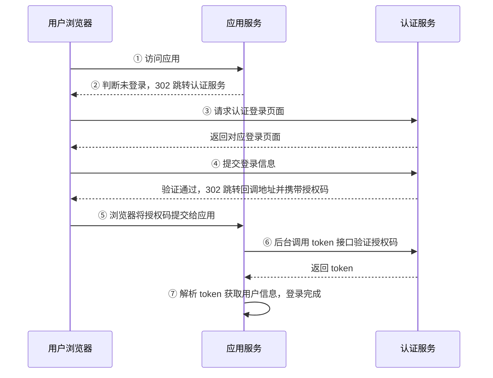

# 单点登录对接说明文档

## 一、功能说明

单点登录服务采用 OpenID Connect 协议（基于 OAuth2 协议的身份认证协议），为所有应用提供统一的登录界面、统一的用户凭据验证、多样化的认证方案，简化了应用的登录认证过程。

### 基本流程



### 步骤说明

1. 用户通过浏览器访问应用，应用判断当前无用户登录，通过 302 跳转到认证服务登录地址（参考第二节"认证登录"）
2. 浏览器跳转到认证服务地址，认证服务判断当前客户端是否已有用户登录：
   - **无登录**：返回登录页面（步骤 ③）
   - **已登录**：直接进入步骤 ④
3. 认证服务根据应用选择的登录方式返回登录页面，用户输入登录凭据后认证服务校验凭据并保存会话信息
4. 登录通过后，认证服务通过 302 重定向到应用的回调地址并返回授权码（参考第二节"回调说明"）
5. 应用收到授权码后，通过后台调用认证服务的 token 接口获取 token（参考《token获取》文档 2.1 授权码模式）
6. 应用得到 token 后，对 token 进行解析获取当前登录用户信息（参考《token获取》文档"Java 代码解析"），将用户信息和 token 保存到应用会话中，登录完成
7. token 有效期默认 3 个小时（可在注册应用配置中修改）；token 续期可参考《token获取》文档 2.2 刷新 Token；refreshToken 有效期默认 7 天（可在注册应用配置中修改）

---

## 二、认证登录

登录跳转接口使用浏览器直接访问或地址重定向（GET 请求），将用户导向认证登录页面，认证完成后返回 code。

### 1. 各环境访问地址

| 环境 | 地址 |
| :--- | :--- |
| UAT 环境 | `https://one-account-gateway.paasuat.cmbchina.cn/auth-server/auth?client_id=xxx&redirect_uri=xxx&response_type=code&scope=xxx&state=xxx` |
| 生产环境（办公网、互联网访问） | `https://oauth-paas.cmbchina.com/auth-server/auth?client_id=xxx&redirect_uri=xxx&response_type=code&scope=xxx&state=xxx` |
| 生产环境（业务网） | `https://oauth-paas.cmbchina.cn/auth-server/auth?client_id=xxx&redirect_uri=xxx&response_type=code&scope=xxx&state=xxx` |

### 2. 参数说明

| 参数 | 格式 | 说明 | 要求 |
| :--- | :--- | :--- | :--- |
| client_id | string | 客户端 id | 必填 |
| response_type | string | 固定值 `code` | 必填 |
| redirect_uri | string | 登录成功后的回调地址，用于接收授权码；需经过 urlencode 编码处理。注意：回调地址不允许携带 `#` 符号 | 选填 |
| scope | string | 申请授权范围 | 选填 |
| state | string | 随机值（建议加上以兼容 IE 缓存问题） | 选填 |

**调用示例**：

```
https://one-account-gateway.paasuat.cmbchina.cn/auth-server/auth?client_id=f8bad92eb4&redirect_uri=http%3A%2F%2Ftest.paas.cmbchina.com%2FTest%2Flogin&response_type=code&scope=default&state=afo0e83ew
```

### 3. 回调说明

用户登录成功后，认证中心将根据 `redirect_uri` 参数跳回应用，并携带授权码信息：

```
HTTP/1.1 302 Found
Location: http://test.paas.cmbchina.com/login?code=5pr9w8f9cwe6g9rh62Wer&state=afo0e83ew
```

### 4. 回调参数

| 参数 | 格式 | 说明 | 要求 |
| :--- | :--- | :--- | :--- |
| code | string | 授权码，用于下一步获取 token | 必填 |
| state | string | 值为上一步调用登录跳转接口传递的 state | 选填 |

> **备注**：token 有效期默认 3 小时，refreshToken 有效期默认 7 天，均可在注册应用配置中修改；刷新 token 可使用 refreshToken 调用对应接口（详见《token获取》文档）。
